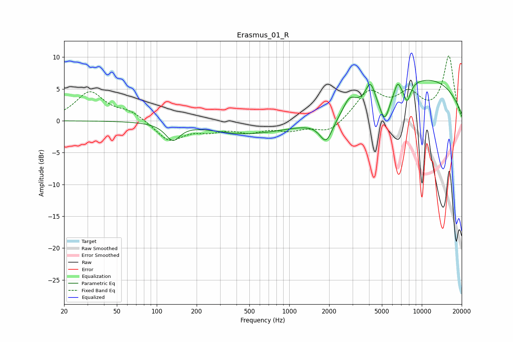

# Erasmus_01_R
See [usage instructions](https://github.com/jaakkopasanen/AutoEq#usage) for more options and info.

### Parametric EQs
Apply preamp of -6.4 dB when using parametric equalizer.

|   # | Type    |   Fc (Hz) |    Q |   Gain (dB) |
|-----|---------|-----------|------|-------------|
|   1 | Peaking |       132 | 2.6  |        -2.6 |
|   2 | Peaking |       440 | 0.55 |        -1.7 |
|   3 | Peaking |      1900 | 2.84 |        -3.7 |
|   4 | Peaking |      2044 | 0.29 |        -1   |
|   5 | Peaking |      2845 | 3.22 |         2.1 |
|   6 | Peaking |      4090 | 4.16 |         3   |
|   7 | Peaking |      5243 | 3.42 |        -4.7 |
|   8 | Peaking |      6569 | 6    |         1.7 |
|   9 | Peaking |      7757 | 5.06 |        -2.8 |
|  10 | Peaking |      9793 | 0.29 |         6.8 |

### Fixed Band EQs
When using fixed band (also called graphic) equalizer, apply preamp of **-10.3 dB** (if available) and set gains manually with these parameters.

|   # | Type    |   Fc (Hz) |    Q |   Gain (dB) |
|-----|---------|-----------|------|-------------|
|   1 | Peaking |        31 | 1.41 |         4.4 |
|   2 | Peaking |        62 | 1.41 |         1.4 |
|   3 | Peaking |       125 | 1.41 |        -3.2 |
|   4 | Peaking |       250 | 1.41 |        -1.2 |
|   5 | Peaking |       500 | 1.41 |        -1.5 |
|   6 | Peaking |      1000 | 1.41 |        -1.2 |
|   7 | Peaking |      2000 | 1.41 |        -1.9 |
|   8 | Peaking |      4000 | 1.41 |         4.5 |
|   9 | Peaking |      8000 | 1.41 |         3.7 |
|  10 | Peaking |     16000 | 1.41 |        10   |

### Graphs

