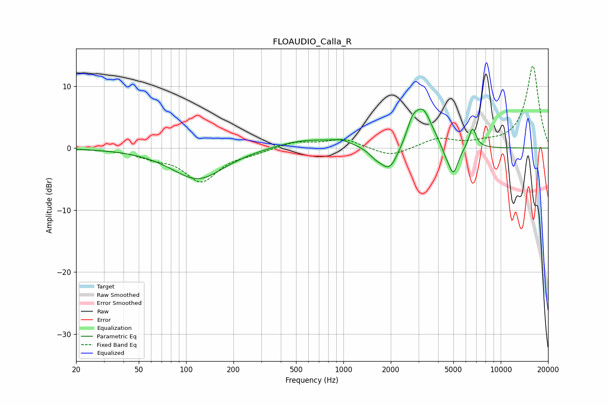

# FLOAUDIO_Calla_R
See [usage instructions](https://github.com/jaakkopasanen/AutoEq#usage) for more options and info.

### Parametric EQs
Apply preamp of -6.4 dB when using parametric equalizer.

|   # | Type    |   Fc (Hz) |    Q |   Gain (dB) |
|-----|---------|-----------|------|-------------|
|   1 | Peaking |       119 | 0.85 |        -5   |
|   2 | Peaking |       585 | 0.72 |         1.5 |
|   3 | Peaking |       972 | 2.37 |         0.7 |
|   4 | Peaking |      1590 | 3.6  |        -0.9 |
|   5 | Peaking |      1958 | 2.45 |        -4.1 |
|   6 | Peaking |      2737 | 4.03 |         2.4 |
|   7 | Peaking |      3196 | 2.35 |         6.1 |
|   8 | Peaking |      4433 | 5.36 |        -0.8 |
|   9 | Peaking |      4989 | 4.21 |        -4.8 |
|  10 | Peaking |      6616 | 5.75 |         3.3 |

### Fixed Band EQs
When using fixed band (also called graphic) equalizer, apply preamp of **-13.3 dB** (if available) and set gains manually with these parameters.

|   # | Type    |   Fc (Hz) |    Q |   Gain (dB) |
|-----|---------|-----------|------|-------------|
|   1 | Peaking |        31 | 1.41 |        -0.1 |
|   2 | Peaking |        62 | 1.41 |        -1.2 |
|   3 | Peaking |       125 | 1.41 |        -5.2 |
|   4 | Peaking |       250 | 1.41 |        -0.6 |
|   5 | Peaking |       500 | 1.41 |         1   |
|   6 | Peaking |      1000 | 1.41 |         1.4 |
|   7 | Peaking |      2000 | 1.41 |        -1.5 |
|   8 | Peaking |      4000 | 1.41 |         1.5 |
|   9 | Peaking |      8000 | 1.41 |         0.6 |
|  10 | Peaking |     16000 | 1.41 |        13.3 |

### Graphs

