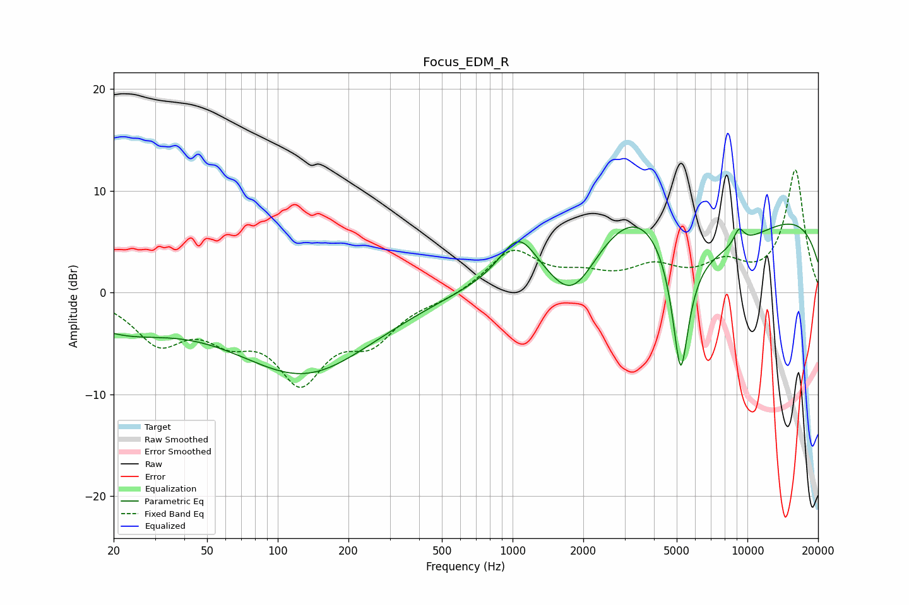

# Focus_EDM_R
See [usage instructions](https://github.com/jaakkopasanen/AutoEq#usage) for more options and info.

### Parametric EQs
Apply preamp of -6.8 dB when using parametric equalizer.

|   # | Type    |   Fc (Hz) |    Q |   Gain (dB) |
|-----|---------|-----------|------|-------------|
|   1 | Peaking |        21 | 0.66 |        -3.1 |
|   2 | Peaking |       131 | 0.45 |        -8.5 |
|   3 | Peaking |       396 | 0.18 |         0.9 |
|   4 | Peaking |      1061 | 1.79 |         4.3 |
|   5 | Peaking |      1799 | 1.35 |        -5.2 |
|   6 | Peaking |      3447 | 0.74 |         5.7 |
|   7 | Peaking |      5197 | 3.63 |       -13.6 |
|   8 | Peaking |      6600 | 0.47 |        -6   |
|   9 | Peaking |      9205 | 5.53 |         1.6 |
|  10 | Peaking |      9894 | 0.19 |         9.3 |

### Fixed Band EQs
When using fixed band (also called graphic) equalizer, apply preamp of **-12.1 dB** (if available) and set gains manually with these parameters.

|   # | Type    |   Fc (Hz) |    Q |   Gain (dB) |
|-----|---------|-----------|------|-------------|
|   1 | Peaking |        31 | 1.41 |        -4.5 |
|   2 | Peaking |        62 | 1.41 |        -3.3 |
|   3 | Peaking |       125 | 1.41 |        -7.8 |
|   4 | Peaking |       250 | 1.41 |        -4   |
|   5 | Peaking |       500 | 1.41 |        -0.6 |
|   6 | Peaking |      1000 | 1.41 |         4.1 |
|   7 | Peaking |      2000 | 1.41 |         1.3 |
|   8 | Peaking |      4000 | 1.41 |         2.2 |
|   9 | Peaking |      8000 | 1.41 |         2.4 |
|  10 | Peaking |     16000 | 1.41 |        12   |

### Graphs

