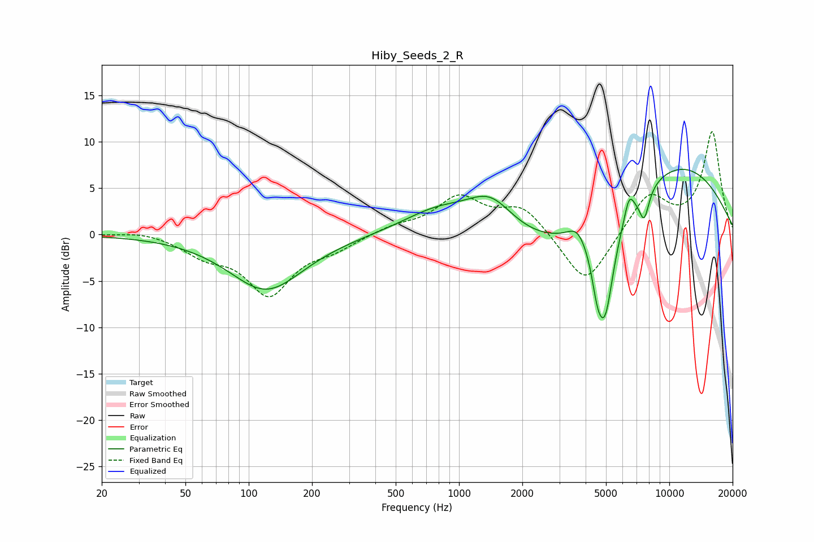

# Hiby_Seeds_2_R
See [usage instructions](https://github.com/jaakkopasanen/AutoEq#usage) for more options and info.

### Parametric EQs
Apply preamp of -7.1 dB when using parametric equalizer.

|   # | Type    |   Fc (Hz) |    Q |   Gain (dB) |
|-----|---------|-----------|------|-------------|
|   1 | Peaking |       121 | 0.8  |        -6   |
|   2 | Peaking |       800 | 0.8  |         2.9 |
|   3 | Peaking |      1411 | 1.2  |         4.3 |
|   4 | Peaking |      3262 | 0.34 |        -3.7 |
|   5 | Peaking |      3654 | 3.08 |         1.6 |
|   6 | Peaking |      4547 | 5.36 |        -3   |
|   7 | Peaking |      4950 | 3.11 |       -10.3 |
|   8 | Peaking |      6442 | 5.97 |         2.3 |
|   9 | Peaking |      7596 | 5.58 |        -3.2 |
|  10 | Peaking |      9954 | 0.36 |         8.7 |

### Fixed Band EQs
When using fixed band (also called graphic) equalizer, apply preamp of **-11.2 dB** (if available) and set gains manually with these parameters.

|   # | Type    |   Fc (Hz) |    Q |   Gain (dB) |
|-----|---------|-----------|------|-------------|
|   1 | Peaking |        31 | 1.41 |         0.4 |
|   2 | Peaking |        62 | 1.41 |        -1.9 |
|   3 | Peaking |       125 | 1.41 |        -6.2 |
|   4 | Peaking |       250 | 1.41 |        -1.3 |
|   5 | Peaking |       500 | 1.41 |         0.8 |
|   6 | Peaking |      1000 | 1.41 |         3.8 |
|   7 | Peaking |      2000 | 1.41 |         3   |
|   8 | Peaking |      4000 | 1.41 |        -5.8 |
|   9 | Peaking |      8000 | 1.41 |         4.3 |
|  10 | Peaking |     16000 | 1.41 |        11   |

### Graphs

