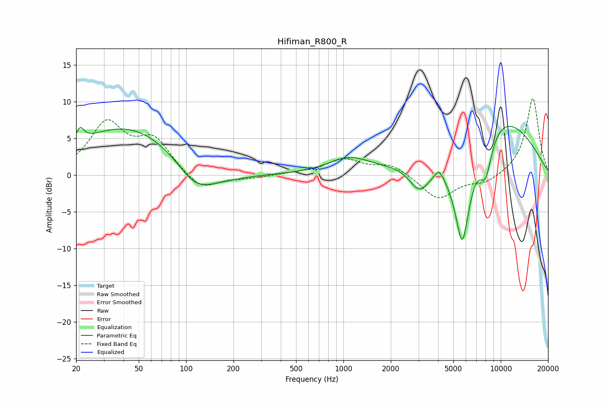

# Hifiman_R800_R
See [usage instructions](https://github.com/jaakkopasanen/AutoEq#usage) for more options and info.

### Parametric EQs
Apply preamp of -6.7 dB when using parametric equalizer.

|   # | Type    |   Fc (Hz) |    Q |   Gain (dB) |
|-----|---------|-----------|------|-------------|
|   1 | Peaking |        21 | 5.8  |         1.8 |
|   2 | Peaking |        42 | 0.42 |         6.7 |
|   3 | Peaking |       114 | 1.21 |        -3.5 |
|   4 | Peaking |       165 | 0.82 |        -1.2 |
|   5 | Peaking |      1084 | 1.06 |         2.1 |
|   6 | Peaking |      3058 | 2.07 |        -3.9 |
|   7 | Peaking |      4044 | 5.92 |         1.1 |
|   8 | Peaking |      5695 | 2.4  |       -14.7 |
|   9 | Peaking |      8018 | 3.19 |        -5.3 |
|  10 | Peaking |      9081 | 0.42 |         8.7 |

### Fixed Band EQs
When using fixed band (also called graphic) equalizer, apply preamp of **-10.5 dB** (if available) and set gains manually with these parameters.

|   # | Type    |   Fc (Hz) |    Q |   Gain (dB) |
|-----|---------|-----------|------|-------------|
|   1 | Peaking |        31 | 1.41 |         6.8 |
|   2 | Peaking |        62 | 1.41 |         4.5 |
|   3 | Peaking |       125 | 1.41 |        -2.3 |
|   4 | Peaking |       250 | 1.41 |        -0.4 |
|   5 | Peaking |       500 | 1.41 |         0.2 |
|   6 | Peaking |      1000 | 1.41 |         2.1 |
|   7 | Peaking |      2000 | 1.41 |         1.5 |
|   8 | Peaking |      4000 | 1.41 |        -3.4 |
|   9 | Peaking |      8000 | 1.41 |        -1.1 |
|  10 | Peaking |     16000 | 1.41 |        10.6 |

### Graphs

