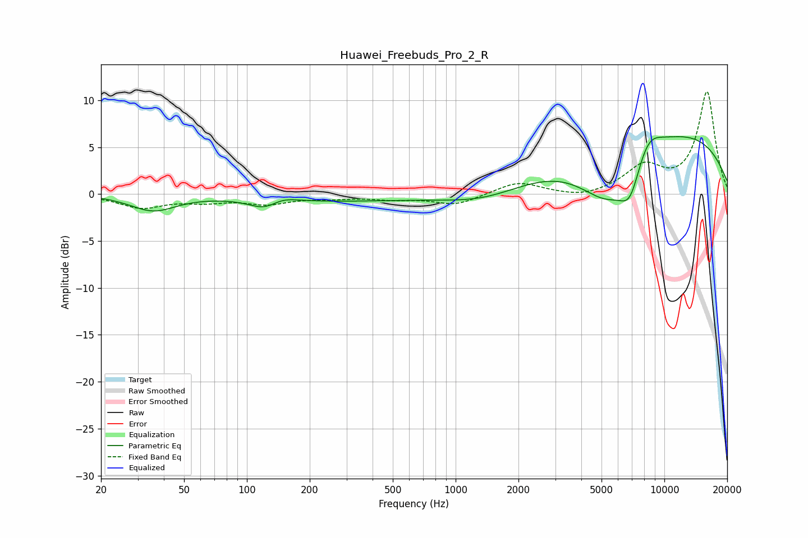

# Huawei_Freebuds_Pro_2_R
See [usage instructions](https://github.com/jaakkopasanen/AutoEq#usage) for more options and info.

### Parametric EQs
Apply preamp of -6.2 dB when using parametric equalizer.

|   # | Type    |   Fc (Hz) |    Q |   Gain (dB) |
|-----|---------|-----------|------|-------------|
|   1 | Peaking |        20 | 4.23 |         0.1 |
|   2 | Peaking |        36 | 1.32 |        -1.7 |
|   3 | Peaking |       122 | 1.93 |        -1.1 |
|   4 | Peaking |       147 | 2.12 |         0.6 |
|   5 | Peaking |       272 | 0.37 |        -0.7 |
|   6 | Peaking |      1392 | 0.71 |        -1.5 |
|   7 | Peaking |      5358 | 0.93 |        -6.3 |
|   8 | Peaking |      6846 | 2.71 |        -3.5 |
|   9 | Peaking |      8322 | 2    |         2.4 |
|  10 | Peaking |      9067 | 0.24 |         7.3 |

### Fixed Band EQs
When using fixed band (also called graphic) equalizer, apply preamp of **-11.0 dB** (if available) and set gains manually with these parameters.

|   # | Type    |   Fc (Hz) |    Q |   Gain (dB) |
|-----|---------|-----------|------|-------------|
|   1 | Peaking |        31 | 1.41 |        -1.4 |
|   2 | Peaking |        62 | 1.41 |        -0.7 |
|   3 | Peaking |       125 | 1.41 |        -0.9 |
|   4 | Peaking |       250 | 1.41 |        -0.3 |
|   5 | Peaking |       500 | 1.41 |        -0.4 |
|   6 | Peaking |      1000 | 1.41 |        -1.1 |
|   7 | Peaking |      2000 | 1.41 |         1.3 |
|   8 | Peaking |      4000 | 1.41 |        -0.5 |
|   9 | Peaking |      8000 | 1.41 |         2.8 |
|  10 | Peaking |     16000 | 1.41 |        10.9 |

### Graphs

