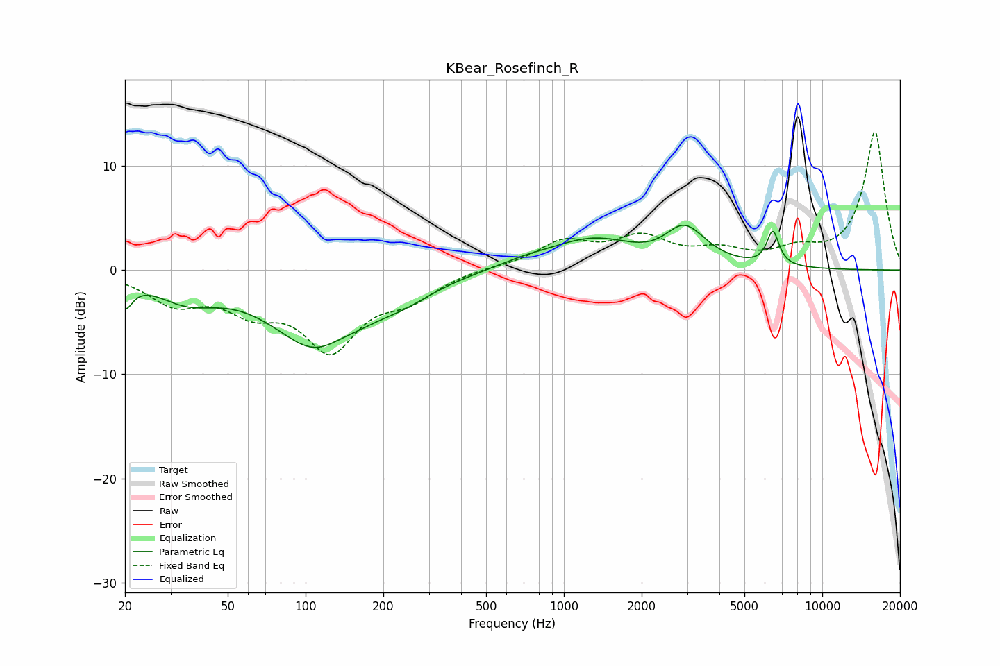

# KBear_Rosefinch_R
See [usage instructions](https://github.com/jaakkopasanen/AutoEq#usage) for more options and info.

### Parametric EQs
Apply preamp of -4.4 dB when using parametric equalizer.

|   # | Type    |   Fc (Hz) |    Q |   Gain (dB) |
|-----|---------|-----------|------|-------------|
|   1 | Peaking |        20 | 4.91 |        -2.5 |
|   2 | Peaking |        35 | 1.2  |        -2.2 |
|   3 | Peaking |       114 | 0.81 |        -7.7 |
|   4 | Peaking |       131 | 1.78 |         0.9 |
|   5 | Peaking |       242 | 1.21 |        -1.2 |
|   6 | Peaking |       705 | 1.31 |         0.5 |
|   7 | Peaking |      1292 | 0.83 |         2.8 |
|   8 | Peaking |      2522 | 1.37 |        -1.1 |
|   9 | Peaking |      2898 | 1.65 |         4.4 |
|  10 | Peaking |      6442 | 5.89 |         3.3 |

### Fixed Band EQs
When using fixed band (also called graphic) equalizer, apply preamp of **-13.4 dB** (if available) and set gains manually with these parameters.

|   # | Type    |   Fc (Hz) |    Q |   Gain (dB) |
|-----|---------|-----------|------|-------------|
|   1 | Peaking |        31 | 1.41 |        -2.9 |
|   2 | Peaking |        62 | 1.41 |        -3.1 |
|   3 | Peaking |       125 | 1.41 |        -7.1 |
|   4 | Peaking |       250 | 1.41 |        -2.2 |
|   5 | Peaking |       500 | 1.41 |         0.2 |
|   6 | Peaking |      1000 | 1.41 |         2.5 |
|   7 | Peaking |      2000 | 1.41 |         2.8 |
|   8 | Peaking |      4000 | 1.41 |         1.5 |
|   9 | Peaking |      8000 | 1.41 |         1.5 |
|  10 | Peaking |     16000 | 1.41 |        13.3 |

### Graphs

