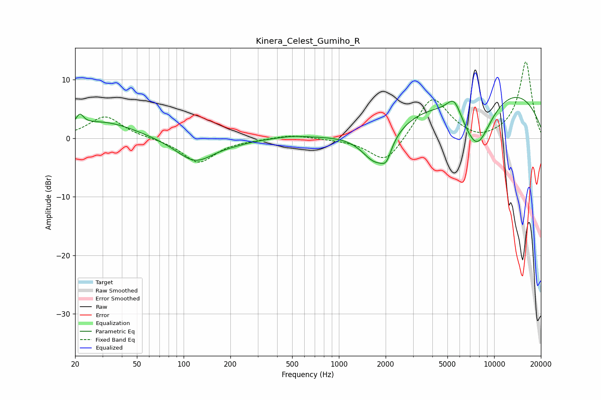

# Kinera_Celest_Gumiho_R
See [usage instructions](https://github.com/jaakkopasanen/AutoEq#usage) for more options and info.

### Parametric EQs
Apply preamp of -7.1 dB when using parametric equalizer.

|   # | Type    |   Fc (Hz) |    Q |   Gain (dB) |
|-----|---------|-----------|------|-------------|
|   1 | Peaking |        21 | 5.95 |         1.9 |
|   2 | Peaking |        30 | 0.67 |         2.9 |
|   3 | Peaking |       119 | 1.13 |        -4.1 |
|   4 | Peaking |       215 | 1.71 |        -0.3 |
|   5 | Peaking |       496 | 1.51 |         0.4 |
|   6 | Peaking |      1730 | 1.53 |        -6.2 |
|   7 | Peaking |      2021 | 4.39 |        -2.5 |
|   8 | Peaking |      5520 | 3    |         3.2 |
|   9 | Peaking |      7715 | 1.18 |       -11   |
|  10 | Peaking |      9135 | 0.25 |        10.3 |

### Fixed Band EQs
When using fixed band (also called graphic) equalizer, apply preamp of **-13.1 dB** (if available) and set gains manually with these parameters.

|   # | Type    |   Fc (Hz) |    Q |   Gain (dB) |
|-----|---------|-----------|------|-------------|
|   1 | Peaking |        31 | 1.41 |         3.8 |
|   2 | Peaking |        62 | 1.41 |        -0   |
|   3 | Peaking |       125 | 1.41 |        -4.2 |
|   4 | Peaking |       250 | 1.41 |        -0.2 |
|   5 | Peaking |       500 | 1.41 |         0.6 |
|   6 | Peaking |      1000 | 1.41 |        -0.1 |
|   7 | Peaking |      2000 | 1.41 |        -4.6 |
|   8 | Peaking |      4000 | 1.41 |         7.3 |
|   9 | Peaking |      8000 | 1.41 |        -0.9 |
|  10 | Peaking |     16000 | 1.41 |        13.1 |

### Graphs

