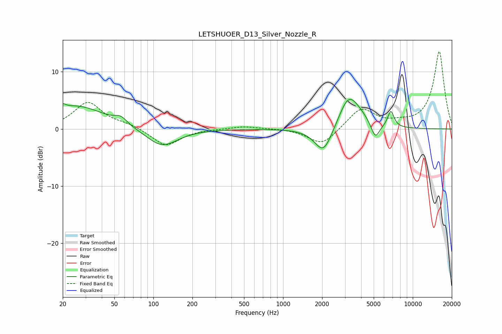

# LETSHUOER_D13_Silver_Nozzle_R
See [usage instructions](https://github.com/jaakkopasanen/AutoEq#usage) for more options and info.

### Parametric EQs
Apply preamp of -5.3 dB when using parametric equalizer.

|   # | Type    |   Fc (Hz) |    Q |   Gain (dB) |
|-----|---------|-----------|------|-------------|
|   1 | Peaking |        20 | 5.97 |         3.2 |
|   2 | Peaking |        20 | 5.98 |        -2.4 |
|   3 | Peaking |        25 | 0.65 |         4   |
|   4 | Peaking |        56 | 3.02 |         1.2 |
|   5 | Peaking |       116 | 1.18 |        -3.2 |
|   6 | Peaking |      2050 | 2.06 |        -4.8 |
|   7 | Peaking |      3184 | 1.87 |         5.3 |
|   8 | Peaking |      3883 | 1.65 |         1.4 |
|   9 | Peaking |      5143 | 4.19 |        -2.8 |
|  10 | Peaking |      6778 | 5.58 |         2.9 |

### Fixed Band EQs
When using fixed band (also called graphic) equalizer, apply preamp of **-13.6 dB** (if available) and set gains manually with these parameters.

|   # | Type    |   Fc (Hz) |    Q |   Gain (dB) |
|-----|---------|-----------|------|-------------|
|   1 | Peaking |        31 | 1.41 |         4.6 |
|   2 | Peaking |        62 | 1.41 |         0.7 |
|   3 | Peaking |       125 | 1.41 |        -3   |
|   4 | Peaking |       250 | 1.41 |         0   |
|   5 | Peaking |       500 | 1.41 |         0.5 |
|   6 | Peaking |      1000 | 1.41 |         0.1 |
|   7 | Peaking |      2000 | 1.41 |        -2.9 |
|   8 | Peaking |      4000 | 1.41 |         3.6 |
|   9 | Peaking |      8000 | 1.41 |         0.7 |
|  10 | Peaking |     16000 | 1.41 |        13.6 |

### Graphs

