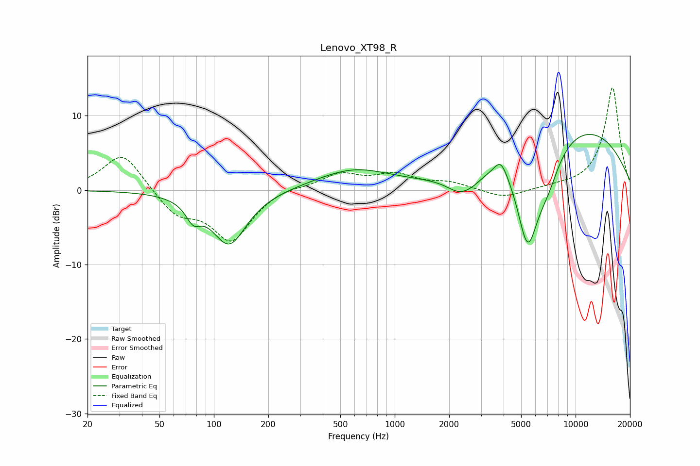

# Lenovo_XT98_R
See [usage instructions](https://github.com/jaakkopasanen/AutoEq#usage) for more options and info.

### Parametric EQs
Apply preamp of -7.6 dB when using parametric equalizer.

|   # | Type    |   Fc (Hz) |    Q |   Gain (dB) |
|-----|---------|-----------|------|-------------|
|   1 | Peaking |        77 | 3.54 |        -2.3 |
|   2 | Peaking |       121 | 1.44 |        -7.3 |
|   3 | Peaking |       594 | 0.68 |         2.7 |
|   4 | Peaking |      2310 | 1.81 |        -2.4 |
|   5 | Peaking |      2728 | 2.79 |        -0.5 |
|   6 | Peaking |      3860 | 3.84 |         2.3 |
|   7 | Peaking |      5395 | 2.57 |        -3.5 |
|   8 | Peaking |      5449 | 2.32 |        -8.1 |
|   9 | Peaking |      6954 | 1.83 |        -4.9 |
|  10 | Peaking |      9836 | 0.31 |         8.7 |

### Fixed Band EQs
When using fixed band (also called graphic) equalizer, apply preamp of **-13.8 dB** (if available) and set gains manually with these parameters.

|   # | Type    |   Fc (Hz) |    Q |   Gain (dB) |
|-----|---------|-----------|------|-------------|
|   1 | Peaking |        31 | 1.41 |         5.2 |
|   2 | Peaking |        62 | 1.41 |        -3.2 |
|   3 | Peaking |       125 | 1.41 |        -6.6 |
|   4 | Peaking |       250 | 1.41 |         0.6 |
|   5 | Peaking |       500 | 1.41 |         2.1 |
|   6 | Peaking |      1000 | 1.41 |         1.9 |
|   7 | Peaking |      2000 | 1.41 |         0.9 |
|   8 | Peaking |      4000 | 1.41 |        -1.2 |
|   9 | Peaking |      8000 | 1.41 |         0.3 |
|  10 | Peaking |     16000 | 1.41 |        13.8 |

### Graphs

