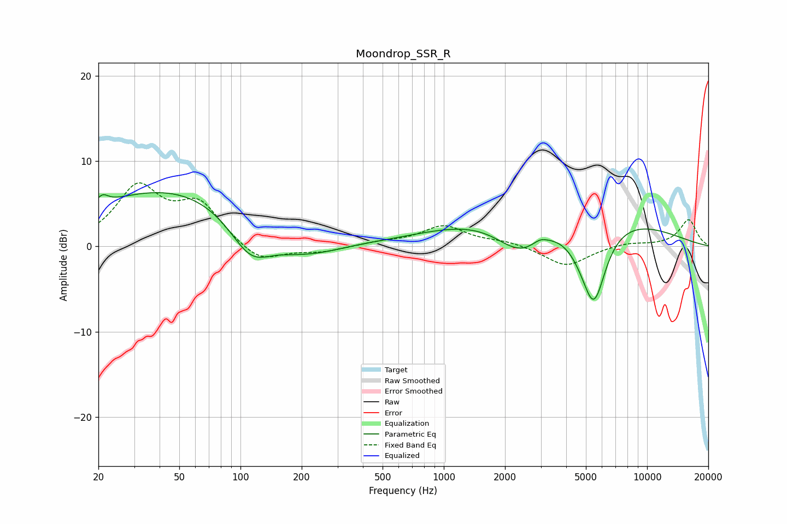

# Moondrop_SSR_R
See [usage instructions](https://github.com/jaakkopasanen/AutoEq#usage) for more options and info.

### Parametric EQs
Apply preamp of -6.4 dB when using parametric equalizer.

|   # | Type    |   Fc (Hz) |    Q |   Gain (dB) |
|-----|---------|-----------|------|-------------|
|   1 | Peaking |        21 | 5.08 |         1.1 |
|   2 | Peaking |        48 | 0.31 |         7   |
|   3 | Peaking |       113 | 1.29 |        -5   |
|   4 | Peaking |       176 | 2.59 |        -0.1 |
|   5 | Peaking |       209 | 0.81 |        -2.4 |
|   6 | Peaking |      2390 | 1.06 |        -5   |
|   7 | Peaking |      2974 | 4.14 |         0.5 |
|   8 | Peaking |      3521 | 0.29 |         5.8 |
|   9 | Peaking |      5219 | 1.48 |        -5.1 |
|  10 | Peaking |      5498 | 2.72 |        -5.6 |

### Fixed Band EQs
When using fixed band (also called graphic) equalizer, apply preamp of **-7.5 dB** (if available) and set gains manually with these parameters.

|   # | Type    |   Fc (Hz) |    Q |   Gain (dB) |
|-----|---------|-----------|------|-------------|
|   1 | Peaking |        31 | 1.41 |         6.6 |
|   2 | Peaking |        62 | 1.41 |         4.6 |
|   3 | Peaking |       125 | 1.41 |        -2.1 |
|   4 | Peaking |       250 | 1.41 |        -0.6 |
|   5 | Peaking |       500 | 1.41 |         0.4 |
|   6 | Peaking |      1000 | 1.41 |         2.3 |
|   7 | Peaking |      2000 | 1.41 |         0.5 |
|   8 | Peaking |      4000 | 1.41 |        -2.4 |
|   9 | Peaking |      8000 | 1.41 |         0.4 |
|  10 | Peaking |     16000 | 1.41 |         3.1 |

### Graphs

