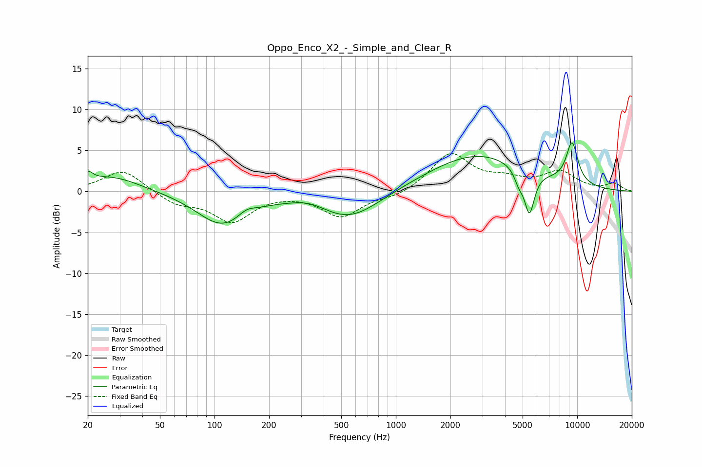

# Oppo_Enco_X2_-_Simple_and_Clear_R
See [usage instructions](https://github.com/jaakkopasanen/AutoEq#usage) for more options and info.

### Parametric EQs
Apply preamp of -6.0 dB when using parametric equalizer.

|   # | Type    |   Fc (Hz) |    Q |   Gain (dB) |
|-----|---------|-----------|------|-------------|
|   1 | Peaking |        20 | 5.45 |         1.1 |
|   2 | Peaking |        27 | 0.89 |         1.9 |
|   3 | Peaking |       110 | 1.01 |        -4   |
|   4 | Peaking |       150 | 3    |         0.8 |
|   5 | Peaking |       337 | 1.58 |         0.7 |
|   6 | Peaking |       554 | 0.82 |        -3.5 |
|   7 | Peaking |      2824 | 0.51 |         4.6 |
|   8 | Peaking |      4763 | 5.78 |        -1.4 |
|   9 | Peaking |      5451 | 4.93 |        -5.3 |
|  10 | Peaking |      9363 | 3.8  |         5   |

### Fixed Band EQs
When using fixed band (also called graphic) equalizer, apply preamp of **-4.7 dB** (if available) and set gains manually with these parameters.

|   # | Type    |   Fc (Hz) |    Q |   Gain (dB) |
|-----|---------|-----------|------|-------------|
|   1 | Peaking |        31 | 1.41 |         2.7 |
|   2 | Peaking |        62 | 1.41 |        -1.5 |
|   3 | Peaking |       125 | 1.41 |        -3.5 |
|   4 | Peaking |       250 | 1.41 |        -0   |
|   5 | Peaking |       500 | 1.41 |        -3   |
|   6 | Peaking |      1000 | 1.41 |        -0.7 |
|   7 | Peaking |      2000 | 1.41 |         4.6 |
|   8 | Peaking |      4000 | 1.41 |         1.2 |
|   9 | Peaking |      8000 | 1.41 |         2.2 |
|  10 | Peaking |     16000 | 1.41 |         0.9 |

### Graphs

