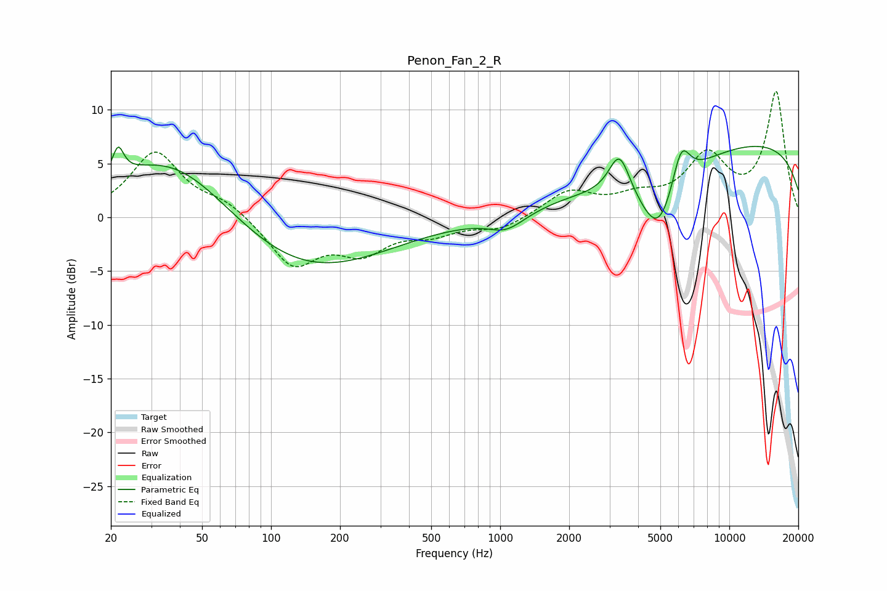

# Penon_Fan_2_R
See [usage instructions](https://github.com/jaakkopasanen/AutoEq#usage) for more options and info.

### Parametric EQs
Apply preamp of -6.7 dB when using parametric equalizer.

|   # | Type    |   Fc (Hz) |    Q |   Gain (dB) |
|-----|---------|-----------|------|-------------|
|   1 | Peaking |        21 | 5.83 |         2.6 |
|   2 | Peaking |        38 | 0.51 |         6.7 |
|   3 | Peaking |       131 | 0.39 |        -5.7 |
|   4 | Peaking |       919 | 1.99 |         0.3 |
|   5 | Peaking |      1042 | 1.58 |        -1.9 |
|   6 | Peaking |      3315 | 3.03 |         4.1 |
|   7 | Peaking |      4457 | 0.65 |        -3.1 |
|   8 | Peaking |      4919 | 1.84 |        -4.9 |
|   9 | Peaking |      6160 | 3.44 |         4   |
|  10 | Peaking |     10000 | 0.18 |         7.3 |

### Fixed Band EQs
When using fixed band (also called graphic) equalizer, apply preamp of **-11.8 dB** (if available) and set gains manually with these parameters.

|   # | Type    |   Fc (Hz) |    Q |   Gain (dB) |
|-----|---------|-----------|------|-------------|
|   1 | Peaking |        31 | 1.41 |         6   |
|   2 | Peaking |        62 | 1.41 |         1.3 |
|   3 | Peaking |       125 | 1.41 |        -4.4 |
|   4 | Peaking |       250 | 1.41 |        -2.9 |
|   5 | Peaking |       500 | 1.41 |        -1.3 |
|   6 | Peaking |      1000 | 1.41 |        -1.1 |
|   7 | Peaking |      2000 | 1.41 |         2.3 |
|   8 | Peaking |      4000 | 1.41 |         1.5 |
|   9 | Peaking |      8000 | 1.41 |         5.3 |
|  10 | Peaking |     16000 | 1.41 |        11.5 |

### Graphs

