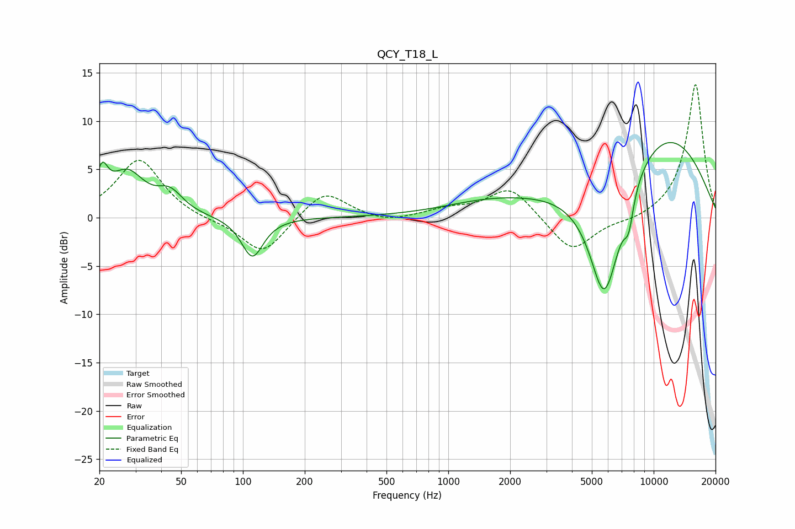

# QCY_T18_L
See [usage instructions](https://github.com/jaakkopasanen/AutoEq#usage) for more options and info.

### Parametric EQs
Apply preamp of -7.9 dB when using parametric equalizer.

|   # | Type    |   Fc (Hz) |    Q |   Gain (dB) |
|-----|---------|-----------|------|-------------|
|   1 | Peaking |        21 | 5.1  |         3.3 |
|   2 | Peaking |        27 | 1.68 |         4.4 |
|   3 | Peaking |        44 | 2.28 |         2.1 |
|   4 | Peaking |       111 | 2.68 |        -4.2 |
|   5 | Peaking |      1546 | 0.62 |         1.3 |
|   6 | Peaking |      5691 | 2.6  |        -4   |
|   7 | Peaking |      5886 | 1.2  |       -11.7 |
|   8 | Peaking |      7556 | 5.64 |        -3   |
|   9 | Peaking |      9180 | 0.32 |         3.8 |
|  10 | Peaking |      9735 | 0.4  |         6.6 |

### Fixed Band EQs
When using fixed band (also called graphic) equalizer, apply preamp of **-13.9 dB** (if available) and set gains manually with these parameters.

|   # | Type    |   Fc (Hz) |    Q |   Gain (dB) |
|-----|---------|-----------|------|-------------|
|   1 | Peaking |        31 | 1.41 |         6.1 |
|   2 | Peaking |        62 | 1.41 |        -0.3 |
|   3 | Peaking |       125 | 1.41 |        -3.9 |
|   4 | Peaking |       250 | 1.41 |         3   |
|   5 | Peaking |       500 | 1.41 |        -0.6 |
|   6 | Peaking |      1000 | 1.41 |         0.8 |
|   7 | Peaking |      2000 | 1.41 |         3.2 |
|   8 | Peaking |      4000 | 1.41 |        -3.7 |
|   9 | Peaking |      8000 | 1.41 |        -0.4 |
|  10 | Peaking |     16000 | 1.41 |        13.9 |

### Graphs

