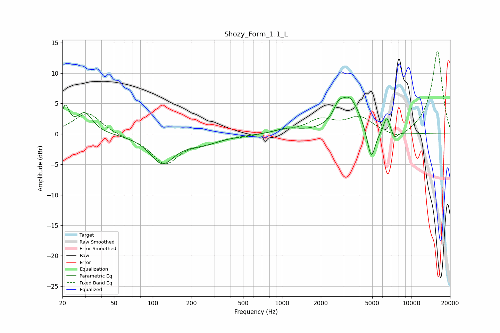

# Shozy_Form_1.1_L
See [usage instructions](https://github.com/jaakkopasanen/AutoEq#usage) for more options and info.

### Parametric EQs
Apply preamp of -6.1 dB when using parametric equalizer.

|   # | Type    |   Fc (Hz) |    Q |   Gain (dB) |
|-----|---------|-----------|------|-------------|
|   1 | Peaking |        21 | 4.88 |         4   |
|   2 | Peaking |        30 | 2.38 |         3.3 |
|   3 | Peaking |       118 | 1.53 |        -4.5 |
|   4 | Peaking |       239 | 0.93 |        -1.4 |
|   5 | Peaking |      1096 | 1.65 |         0.8 |
|   6 | Peaking |      2731 | 4.2  |         1.7 |
|   7 | Peaking |      3333 | 1.69 |         5.9 |
|   8 | Peaking |      4914 | 4.24 |        -5.6 |
|   9 | Peaking |      6476 | 5.89 |         2.7 |
|  10 | Peaking |      7459 | 6    |        -1.2 |

### Fixed Band EQs
When using fixed band (also called graphic) equalizer, apply preamp of **-13.6 dB** (if available) and set gains manually with these parameters.

|   # | Type    |   Fc (Hz) |    Q |   Gain (dB) |
|-----|---------|-----------|------|-------------|
|   1 | Peaking |        31 | 1.41 |         3.6 |
|   2 | Peaking |        62 | 1.41 |        -0.4 |
|   3 | Peaking |       125 | 1.41 |        -4.7 |
|   4 | Peaking |       250 | 1.41 |        -1.2 |
|   5 | Peaking |       500 | 1.41 |        -0.3 |
|   6 | Peaking |      1000 | 1.41 |         0.4 |
|   7 | Peaking |      2000 | 1.41 |         2.1 |
|   8 | Peaking |      4000 | 1.41 |         2.5 |
|   9 | Peaking |      8000 | 1.41 |        -1.4 |
|  10 | Peaking |     16000 | 1.41 |        13.7 |

### Graphs

