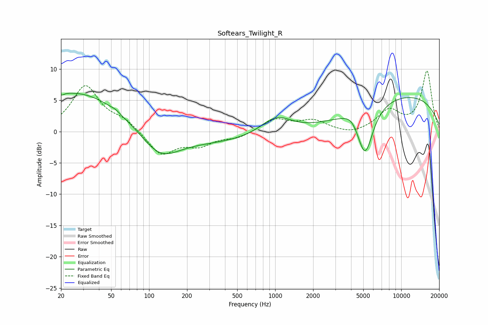

# Softears_Twilight_R
See [usage instructions](https://github.com/jaakkopasanen/AutoEq#usage) for more options and info.

### Parametric EQs
Apply preamp of -6.2 dB when using parametric equalizer.

|   # | Type    |   Fc (Hz) |    Q |   Gain (dB) |
|-----|---------|-----------|------|-------------|
|   1 | Peaking |        20 | 4.96 |         2.1 |
|   2 | Peaking |        20 | 5.83 |        -2.1 |
|   3 | Peaking |        28 | 0.37 |         6.5 |
|   4 | Peaking |        54 | 5.01 |         0.2 |
|   5 | Peaking |       121 | 0.95 |        -3.9 |
|   6 | Peaking |       382 | 0.18 |        -1.8 |
|   7 | Peaking |      1021 | 1.07 |         3.3 |
|   8 | Peaking |      4038 | 2.36 |         1.2 |
|   9 | Peaking |      5160 | 2.16 |        -8.1 |
|  10 | Peaking |     10000 | 0.26 |         5.8 |

### Fixed Band EQs
When using fixed band (also called graphic) equalizer, apply preamp of **-9.8 dB** (if available) and set gains manually with these parameters.

|   # | Type    |   Fc (Hz) |    Q |   Gain (dB) |
|-----|---------|-----------|------|-------------|
|   1 | Peaking |        31 | 1.41 |         7.2 |
|   2 | Peaking |        62 | 1.41 |         1.6 |
|   3 | Peaking |       125 | 1.41 |        -3.8 |
|   4 | Peaking |       250 | 1.41 |        -1.9 |
|   5 | Peaking |       500 | 1.41 |        -1   |
|   6 | Peaking |      1000 | 1.41 |         2   |
|   7 | Peaking |      2000 | 1.41 |         1.6 |
|   8 | Peaking |      4000 | 1.41 |        -0.6 |
|   9 | Peaking |      8000 | 1.41 |         3.2 |
|  10 | Peaking |     16000 | 1.41 |         9.6 |

### Graphs

