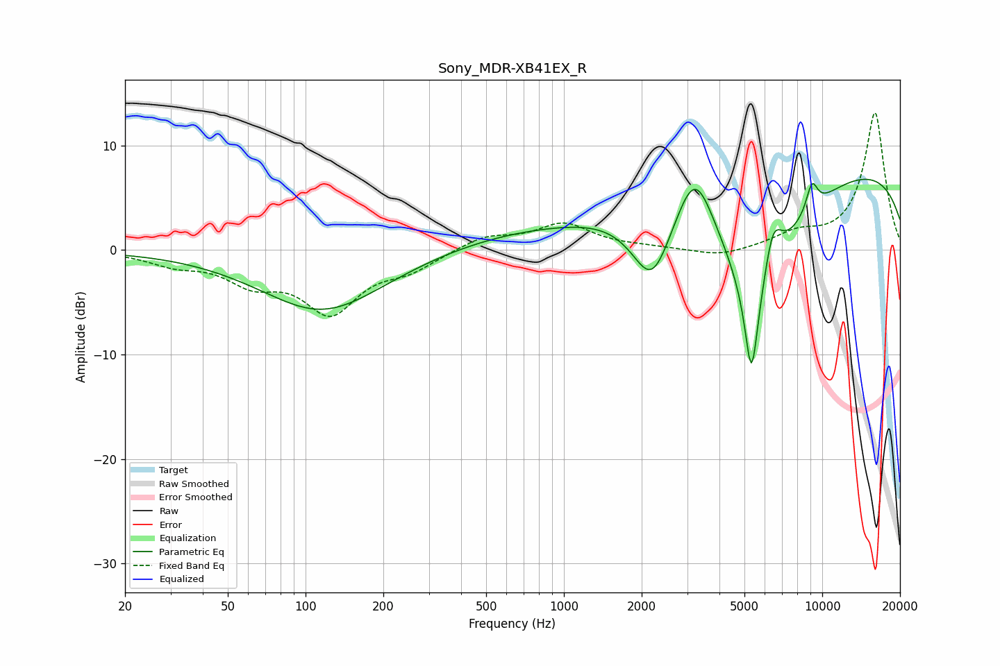

# Sony_MDR-XB41EX_R
See [usage instructions](https://github.com/jaakkopasanen/AutoEq#usage) for more options and info.

### Parametric EQs
Apply preamp of -6.9 dB when using parametric equalizer.

|   # | Type    |   Fc (Hz) |    Q |   Gain (dB) |
|-----|---------|-----------|------|-------------|
|   1 | Peaking |       116 | 0.59 |        -5.9 |
|   2 | Peaking |       979 | 0.65 |        -0.6 |
|   3 | Peaking |      1014 | 0.38 |         2.5 |
|   4 | Peaking |      2196 | 1.77 |        -7.1 |
|   5 | Peaking |      3213 | 1.87 |         6.8 |
|   6 | Peaking |      5321 | 5.75 |        -8.3 |
|   7 | Peaking |      5589 | 1    |       -13.4 |
|   8 | Peaking |      6425 | 3.47 |         5.6 |
|   9 | Peaking |      9122 | 5.58 |         2.7 |
|  10 | Peaking |     10000 | 0.18 |         8.5 |

### Fixed Band EQs
When using fixed band (also called graphic) equalizer, apply preamp of **-13.2 dB** (if available) and set gains manually with these parameters.

|   # | Type    |   Fc (Hz) |    Q |   Gain (dB) |
|-----|---------|-----------|------|-------------|
|   1 | Peaking |        31 | 1.41 |        -1.1 |
|   2 | Peaking |        62 | 1.41 |        -2.6 |
|   3 | Peaking |       125 | 1.41 |        -5.6 |
|   4 | Peaking |       250 | 1.41 |        -1.6 |
|   5 | Peaking |       500 | 1.41 |         1.3 |
|   6 | Peaking |      1000 | 1.41 |         2.4 |
|   7 | Peaking |      2000 | 1.41 |         0.2 |
|   8 | Peaking |      4000 | 1.41 |        -0.7 |
|   9 | Peaking |      8000 | 1.41 |         1.3 |
|  10 | Peaking |     16000 | 1.41 |        13.2 |

### Graphs

