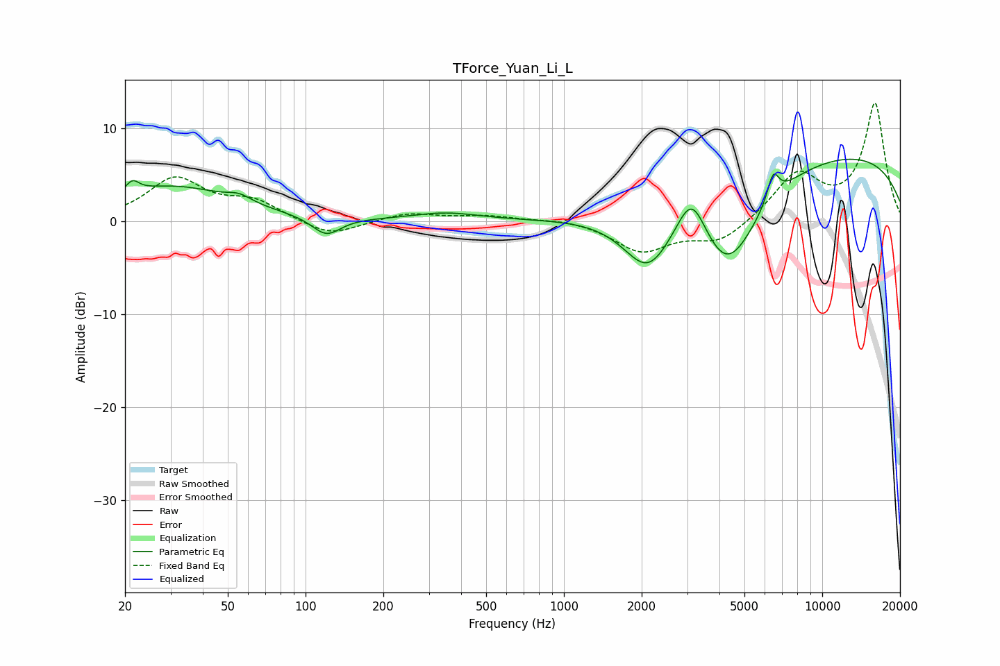

# TForce_Yuan_Li_L
See [usage instructions](https://github.com/jaakkopasanen/AutoEq#usage) for more options and info.

### Parametric EQs
Apply preamp of -6.8 dB when using parametric equalizer.

|   # | Type    |   Fc (Hz) |    Q |   Gain (dB) |
|-----|---------|-----------|------|-------------|
|   1 | Peaking |        21 | 5.73 |         1.2 |
|   2 | Peaking |        30 | 0.6  |         3.7 |
|   3 | Peaking |        55 | 3.03 |         0.8 |
|   4 | Peaking |       120 | 2.55 |        -2   |
|   5 | Peaking |       349 | 1.07 |         0.9 |
|   6 | Peaking |      2111 | 1.47 |        -6.1 |
|   7 | Peaking |      3122 | 2.39 |         5.5 |
|   8 | Peaking |      4290 | 1.08 |       -10.1 |
|   9 | Peaking |      6455 | 6    |         3   |
|  10 | Peaking |     10000 | 0.21 |         7.6 |

### Fixed Band EQs
When using fixed band (also called graphic) equalizer, apply preamp of **-12.8 dB** (if available) and set gains manually with these parameters.

|   # | Type    |   Fc (Hz) |    Q |   Gain (dB) |
|-----|---------|-----------|------|-------------|
|   1 | Peaking |        31 | 1.41 |         4.5 |
|   2 | Peaking |        62 | 1.41 |         2   |
|   3 | Peaking |       125 | 1.41 |        -1.7 |
|   4 | Peaking |       250 | 1.41 |         0.9 |
|   5 | Peaking |       500 | 1.41 |         0.6 |
|   6 | Peaking |      1000 | 1.41 |         0.3 |
|   7 | Peaking |      2000 | 1.41 |        -3.2 |
|   8 | Peaking |      4000 | 1.41 |        -2.3 |
|   9 | Peaking |      8000 | 1.41 |         5   |
|  10 | Peaking |     16000 | 1.41 |        12.6 |

### Graphs

