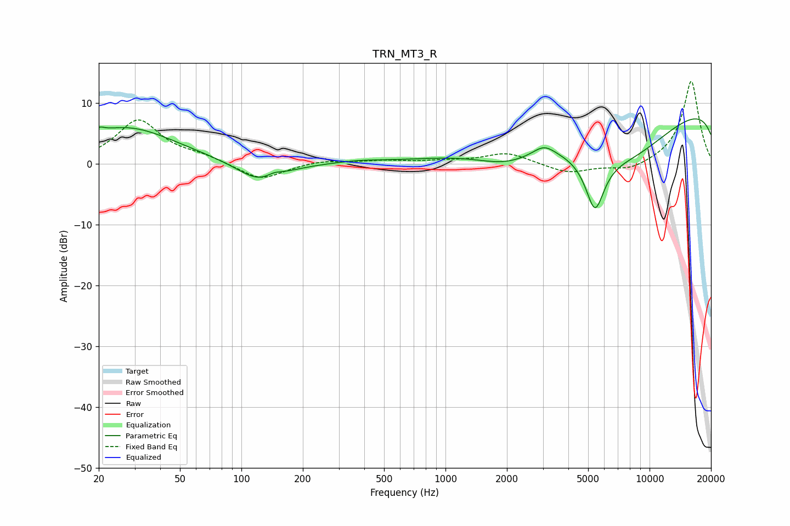

# TRN_MT3_R
See [usage instructions](https://github.com/jaakkopasanen/AutoEq#usage) for more options and info.

### Parametric EQs
Apply preamp of -7.5 dB when using parametric equalizer.

|   # | Type    |   Fc (Hz) |    Q |   Gain (dB) |
|-----|---------|-----------|------|-------------|
|   1 | Peaking |        20 | 5.89 |         0.8 |
|   2 | Peaking |        27 | 0.58 |         6   |
|   3 | Peaking |       124 | 1.27 |        -3.5 |
|   4 | Peaking |       144 | 3.48 |         0.8 |
|   5 | Peaking |       377 | 1.15 |         0.4 |
|   6 | Peaking |      1975 | 0.92 |        -2.7 |
|   7 | Peaking |      3039 | 2.63 |         1.7 |
|   8 | Peaking |      5399 | 2.92 |        -9   |
|   9 | Peaking |      7787 | 0.38 |       -13.3 |
|  10 | Peaking |     10000 | 0.18 |        15.5 |

### Fixed Band EQs
When using fixed band (also called graphic) equalizer, apply preamp of **-13.7 dB** (if available) and set gains manually with these parameters.

|   # | Type    |   Fc (Hz) |    Q |   Gain (dB) |
|-----|---------|-----------|------|-------------|
|   1 | Peaking |        31 | 1.41 |         7.2 |
|   2 | Peaking |        62 | 1.41 |         1   |
|   3 | Peaking |       125 | 1.41 |        -2.7 |
|   4 | Peaking |       250 | 1.41 |         0.6 |
|   5 | Peaking |       500 | 1.41 |         0.5 |
|   6 | Peaking |      1000 | 1.41 |         0.4 |
|   7 | Peaking |      2000 | 1.41 |         1.9 |
|   8 | Peaking |      4000 | 1.41 |        -1.6 |
|   9 | Peaking |      8000 | 1.41 |        -1.2 |
|  10 | Peaking |     16000 | 1.41 |        13.8 |

### Graphs

