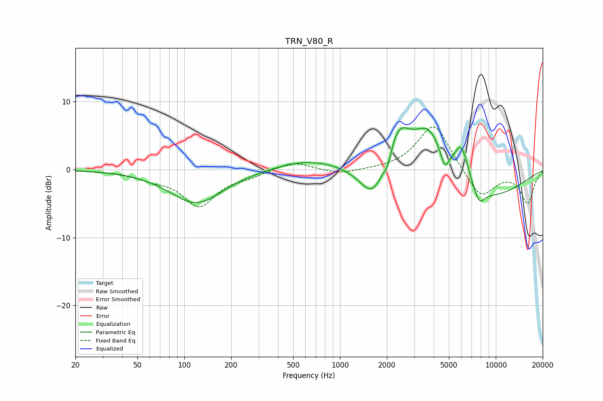

# TRN_V80_R
See [usage instructions](https://github.com/jaakkopasanen/AutoEq#usage) for more options and info.

### Parametric EQs
Apply preamp of -6.2 dB when using parametric equalizer.

|   # | Type    |   Fc (Hz) |    Q |   Gain (dB) |
|-----|---------|-----------|------|-------------|
|   1 | Peaking |       120 | 0.83 |        -5   |
|   2 | Peaking |       628 | 0.68 |         1.5 |
|   3 | Peaking |      1647 | 1.64 |        -6.3 |
|   4 | Peaking |      2033 | 5.38 |        -2.2 |
|   5 | Peaking |      2320 | 1.55 |         7.7 |
|   6 | Peaking |      3713 | 1.52 |         6.3 |
|   7 | Peaking |      4704 | 5.97 |        -2.2 |
|   8 | Peaking |      6009 | 2.88 |         5.6 |
|   9 | Peaking |      7816 | 3.78 |        -2.2 |
|  10 | Peaking |      8005 | 0.45 |        -4.5 |

### Fixed Band EQs
When using fixed band (also called graphic) equalizer, apply preamp of **-6.4 dB** (if available) and set gains manually with these parameters.

|   # | Type    |   Fc (Hz) |    Q |   Gain (dB) |
|-----|---------|-----------|------|-------------|
|   1 | Peaking |        31 | 1.41 |        -0.1 |
|   2 | Peaking |        62 | 1.41 |        -1.1 |
|   3 | Peaking |       125 | 1.41 |        -5.2 |
|   4 | Peaking |       250 | 1.41 |        -0.8 |
|   5 | Peaking |       500 | 1.41 |         1.3 |
|   6 | Peaking |      1000 | 1.41 |        -0.7 |
|   7 | Peaking |      2000 | 1.41 |        -0.1 |
|   8 | Peaking |      4000 | 1.41 |         7   |
|   9 | Peaking |      8000 | 1.41 |        -4.3 |
|  10 | Peaking |     16000 | 1.41 |        -4.9 |

### Graphs

