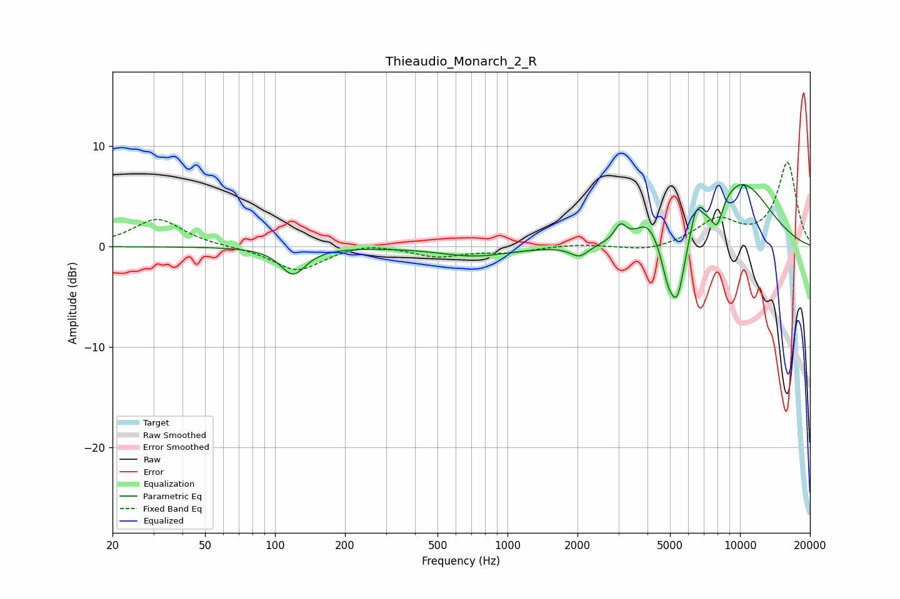

# Thieaudio_Monarch_2_R
See [usage instructions](https://github.com/jaakkopasanen/AutoEq#usage) for more options and info.

### Parametric EQs
Apply preamp of -6.3 dB when using parametric equalizer.

|   # | Type    |   Fc (Hz) |    Q |   Gain (dB) |
|-----|---------|-----------|------|-------------|
|   1 | Peaking |       120 | 2.6  |        -2.7 |
|   2 | Peaking |       725 | 0.95 |        -0.9 |
|   3 | Peaking |      2040 | 3.57 |        -1.1 |
|   4 | Peaking |      3058 | 5.53 |         1.6 |
|   5 | Peaking |      3988 | 2.99 |         1.9 |
|   6 | Peaking |      4879 | 4.99 |        -2.6 |
|   7 | Peaking |      5372 | 4.01 |        -6.5 |
|   8 | Peaking |      6475 | 6    |         2.3 |
|   9 | Peaking |      7971 | 5.06 |        -2.7 |
|  10 | Peaking |     10000 | 0.83 |         6.5 |

### Fixed Band EQs
When using fixed band (also called graphic) equalizer, apply preamp of **-8.5 dB** (if available) and set gains manually with these parameters.

|   # | Type    |   Fc (Hz) |    Q |   Gain (dB) |
|-----|---------|-----------|------|-------------|
|   1 | Peaking |        31 | 1.41 |         2.8 |
|   2 | Peaking |        62 | 1.41 |        -0   |
|   3 | Peaking |       125 | 1.41 |        -2.4 |
|   4 | Peaking |       250 | 1.41 |         0.5 |
|   5 | Peaking |       500 | 1.41 |        -1   |
|   6 | Peaking |      1000 | 1.41 |        -0.5 |
|   7 | Peaking |      2000 | 1.41 |         0.2 |
|   8 | Peaking |      4000 | 1.41 |        -0.5 |
|   9 | Peaking |      8000 | 1.41 |         2.5 |
|  10 | Peaking |     16000 | 1.41 |         8.3 |

### Graphs

