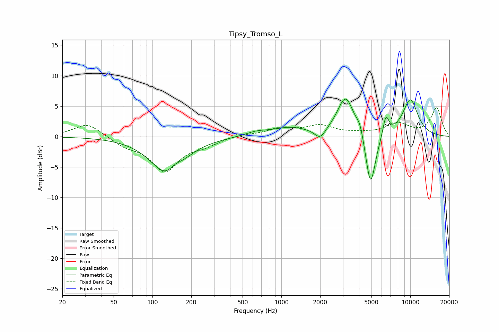

# Tipsy_Tromso_L
See [usage instructions](https://github.com/jaakkopasanen/AutoEq#usage) for more options and info.

### Parametric EQs
Apply preamp of -6.2 dB when using parametric equalizer.

|   # | Type    |   Fc (Hz) |    Q |   Gain (dB) |
|-----|---------|-----------|------|-------------|
|   1 | Peaking |       131 | 1.1  |        -6.3 |
|   2 | Peaking |       149 | 3.05 |         1.1 |
|   3 | Peaking |       640 | 1.65 |         0.6 |
|   4 | Peaking |      1169 | 1.01 |         1.4 |
|   5 | Peaking |      1999 | 3.34 |        -1.7 |
|   6 | Peaking |      3154 | 2.16 |         6.6 |
|   7 | Peaking |      4079 | 4.89 |         1.9 |
|   8 | Peaking |      4918 | 3.44 |        -9.4 |
|   9 | Peaking |      6462 | 5.71 |         3.4 |
|  10 | Peaking |     10000 | 1.95 |         6   |

### Fixed Band EQs
When using fixed band (also called graphic) equalizer, apply preamp of **-4.8 dB** (if available) and set gains manually with these parameters.

|   # | Type    |   Fc (Hz) |    Q |   Gain (dB) |
|-----|---------|-----------|------|-------------|
|   1 | Peaking |        31 | 1.41 |         2.2 |
|   2 | Peaking |        62 | 1.41 |        -1.3 |
|   3 | Peaking |       125 | 1.41 |        -5.5 |
|   4 | Peaking |       250 | 1.41 |        -1.1 |
|   5 | Peaking |       500 | 1.41 |         0.3 |
|   6 | Peaking |      1000 | 1.41 |         1.3 |
|   7 | Peaking |      2000 | 1.41 |         1.6 |
|   8 | Peaking |      4000 | 1.41 |         0.4 |
|   9 | Peaking |      8000 | 1.41 |         2   |
|  10 | Peaking |     16000 | 1.41 |         4.6 |

### Graphs

