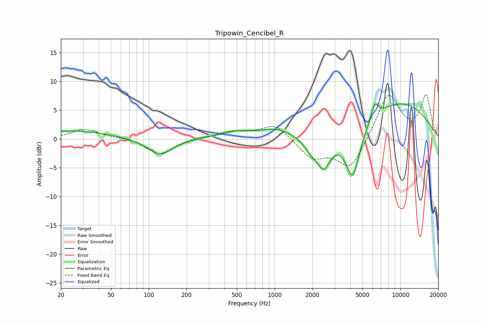

# Tripowin_Cencibel_R
See [usage instructions](https://github.com/jaakkopasanen/AutoEq#usage) for more options and info.

### Parametric EQs
Apply preamp of -6.2 dB when using parametric equalizer.

|   # | Type    |   Fc (Hz) |    Q |   Gain (dB) |
|-----|---------|-----------|------|-------------|
|   1 | Peaking |        25 | 0.51 |         1.4 |
|   2 | Peaking |       122 | 1.46 |        -2.9 |
|   3 | Peaking |       459 | 1.19 |         1.1 |
|   4 | Peaking |      1014 | 1.05 |         1.6 |
|   5 | Peaking |      1910 | 2.84 |        -1.6 |
|   6 | Peaking |      2446 | 2.47 |        -5.4 |
|   7 | Peaking |      4178 | 2.43 |        -9   |
|   8 | Peaking |      6223 | 6    |         1.7 |
|   9 | Peaking |      6292 | 3.54 |         1.1 |
|  10 | Peaking |      9778 | 0.42 |         6.3 |

### Fixed Band EQs
When using fixed band (also called graphic) equalizer, apply preamp of **-7.8 dB** (if available) and set gains manually with these parameters.

|   # | Type    |   Fc (Hz) |    Q |   Gain (dB) |
|-----|---------|-----------|------|-------------|
|   1 | Peaking |        31 | 1.41 |         1.7 |
|   2 | Peaking |        62 | 1.41 |         0.2 |
|   3 | Peaking |       125 | 1.41 |        -2.7 |
|   4 | Peaking |       250 | 1.41 |         0.4 |
|   5 | Peaking |       500 | 1.41 |         1.1 |
|   6 | Peaking |      1000 | 1.41 |         2.6 |
|   7 | Peaking |      2000 | 1.41 |        -3.2 |
|   8 | Peaking |      4000 | 1.41 |        -5.4 |
|   9 | Peaking |      8000 | 1.41 |         8   |
|  10 | Peaking |     16000 | 1.41 |         7.4 |

### Graphs

