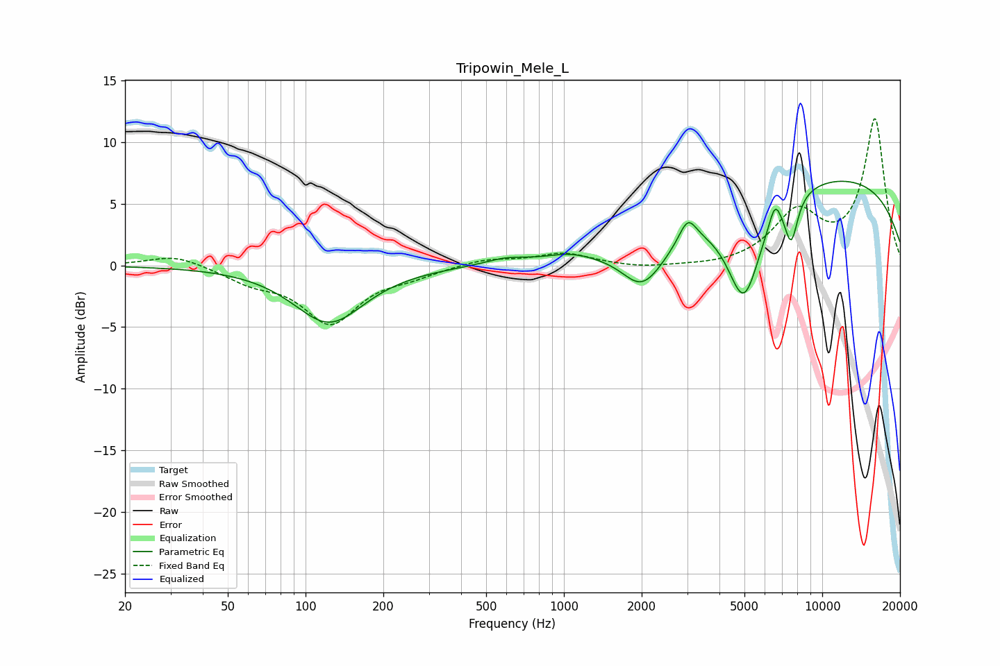

# Tripowin_Mele_L
See [usage instructions](https://github.com/jaakkopasanen/AutoEq#usage) for more options and info.

### Parametric EQs
Apply preamp of -6.9 dB when using parametric equalizer.

|   # | Type    |   Fc (Hz) |    Q |   Gain (dB) |
|-----|---------|-----------|------|-------------|
|   1 | Peaking |       123 | 1.04 |        -4.6 |
|   2 | Peaking |       596 | 1.74 |         0.5 |
|   3 | Peaking |      1049 | 1.62 |         0.5 |
|   4 | Peaking |      1955 | 2.37 |        -0.7 |
|   5 | Peaking |      2063 | 1.51 |        -3.2 |
|   6 | Peaking |      3017 | 4.16 |         2   |
|   7 | Peaking |      4979 | 2.06 |        -8.1 |
|   8 | Peaking |      6560 | 6    |         1.8 |
|   9 | Peaking |      7584 | 5.22 |        -3.6 |
|  10 | Peaking |     10000 | 0.23 |         7.3 |

### Fixed Band EQs
When using fixed band (also called graphic) equalizer, apply preamp of **-12.0 dB** (if available) and set gains manually with these parameters.

|   # | Type    |   Fc (Hz) |    Q |   Gain (dB) |
|-----|---------|-----------|------|-------------|
|   1 | Peaking |        31 | 1.41 |         0.9 |
|   2 | Peaking |        62 | 1.41 |        -1.2 |
|   3 | Peaking |       125 | 1.41 |        -4.5 |
|   4 | Peaking |       250 | 1.41 |        -0.7 |
|   5 | Peaking |       500 | 1.41 |         0.5 |
|   6 | Peaking |      1000 | 1.41 |         1   |
|   7 | Peaking |      2000 | 1.41 |        -0.3 |
|   8 | Peaking |      4000 | 1.41 |        -0.2 |
|   9 | Peaking |      8000 | 1.41 |         4.1 |
|  10 | Peaking |     16000 | 1.41 |        11.8 |

### Graphs

