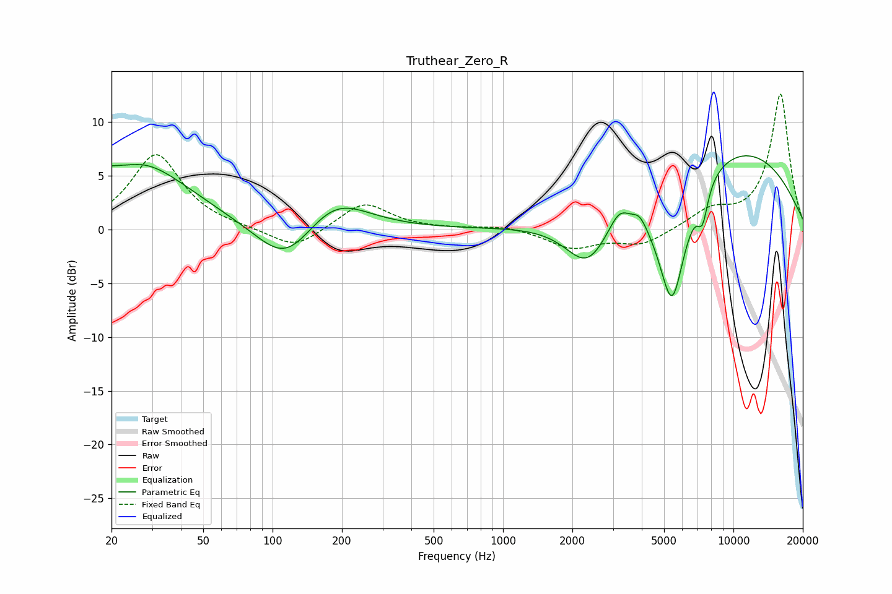

# Truthear_Zero_R
See [usage instructions](https://github.com/jaakkopasanen/AutoEq#usage) for more options and info.

### Parametric EQs
Apply preamp of -7.0 dB when using parametric equalizer.

|   # | Type    |   Fc (Hz) |    Q |   Gain (dB) |
|-----|---------|-----------|------|-------------|
|   1 | Peaking |        22 | 1.52 |        -1.5 |
|   2 | Peaking |        23 | 0.61 |         7.6 |
|   3 | Peaking |       115 | 1.09 |        -4.3 |
|   4 | Peaking |       184 | 0.98 |         3.4 |
|   5 | Peaking |      2327 | 1.46 |        -4.6 |
|   6 | Peaking |      3187 | 3.14 |         1.8 |
|   7 | Peaking |      3920 | 4.5  |         1   |
|   8 | Peaking |      5415 | 2.15 |       -11.9 |
|   9 | Peaking |      7345 | 5.68 |        -3   |
|  10 | Peaking |      9607 | 0.33 |         7.9 |

### Fixed Band EQs
When using fixed band (also called graphic) equalizer, apply preamp of **-12.7 dB** (if available) and set gains manually with these parameters.

|   # | Type    |   Fc (Hz) |    Q |   Gain (dB) |
|-----|---------|-----------|------|-------------|
|   1 | Peaking |        31 | 1.41 |         7   |
|   2 | Peaking |        62 | 1.41 |         0.1 |
|   3 | Peaking |       125 | 1.41 |        -1.9 |
|   4 | Peaking |       250 | 1.41 |         2.6 |
|   5 | Peaking |       500 | 1.41 |         0   |
|   6 | Peaking |      1000 | 1.41 |         0.4 |
|   7 | Peaking |      2000 | 1.41 |        -1.7 |
|   8 | Peaking |      4000 | 1.41 |        -1.4 |
|   9 | Peaking |      8000 | 1.41 |         1.6 |
|  10 | Peaking |     16000 | 1.41 |        12.6 |

### Graphs

