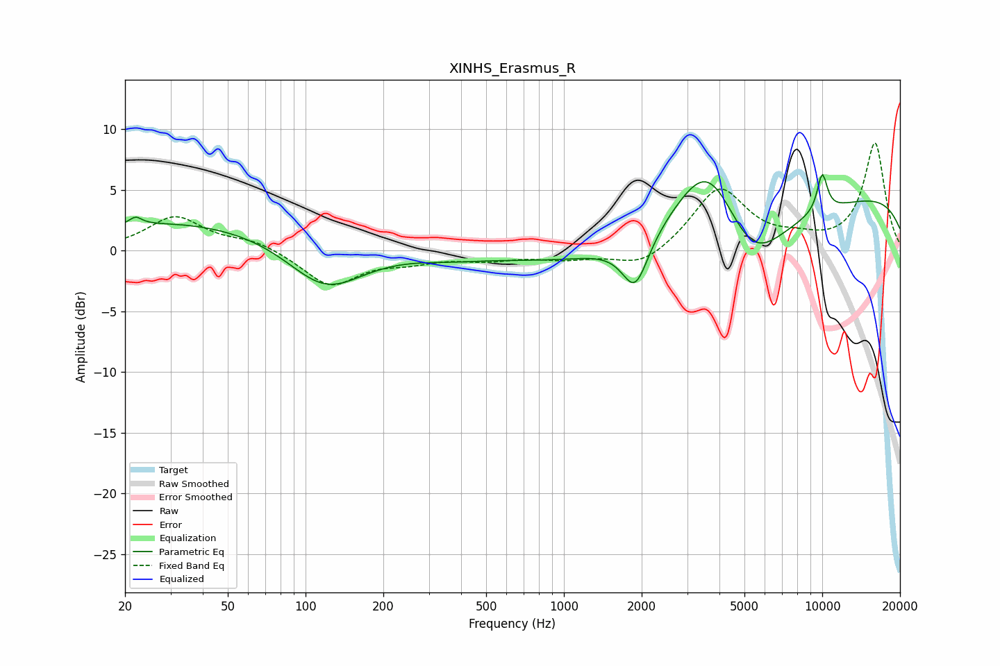

# XINHS_Erasmus_R
See [usage instructions](https://github.com/jaakkopasanen/AutoEq#usage) for more options and info.

### Parametric EQs
Apply preamp of -6.4 dB when using parametric equalizer.

|   # | Type    |   Fc (Hz) |    Q |   Gain (dB) |
|-----|---------|-----------|------|-------------|
|   1 | Peaking |        22 | 5.97 |         0.6 |
|   2 | Peaking |        35 | 0.31 |         2.5 |
|   3 | Peaking |       119 | 0.96 |        -3.9 |
|   4 | Peaking |       360 | 1.19 |        -0.3 |
|   5 | Peaking |      1889 | 2.77 |        -4.2 |
|   6 | Peaking |      3530 | 0.19 |        -2.4 |
|   7 | Peaking |      3636 | 1.09 |         7.1 |
|   8 | Peaking |      5287 | 1.07 |        -5.6 |
|   9 | Peaking |     10000 | 0.18 |         5.5 |
|  10 | Peaking |     10000 | 5.95 |         3.2 |

### Fixed Band EQs
When using fixed band (also called graphic) equalizer, apply preamp of **-8.9 dB** (if available) and set gains manually with these parameters.

|   # | Type    |   Fc (Hz) |    Q |   Gain (dB) |
|-----|---------|-----------|------|-------------|
|   1 | Peaking |        31 | 1.41 |         2.7 |
|   2 | Peaking |        62 | 1.41 |         0.8 |
|   3 | Peaking |       125 | 1.41 |        -2.9 |
|   4 | Peaking |       250 | 1.41 |        -0.7 |
|   5 | Peaking |       500 | 1.41 |        -0.6 |
|   6 | Peaking |      1000 | 1.41 |        -0.6 |
|   7 | Peaking |      2000 | 1.41 |        -1.5 |
|   8 | Peaking |      4000 | 1.41 |         5.1 |
|   9 | Peaking |      8000 | 1.41 |         0.6 |
|  10 | Peaking |     16000 | 1.41 |         8.8 |

### Graphs

