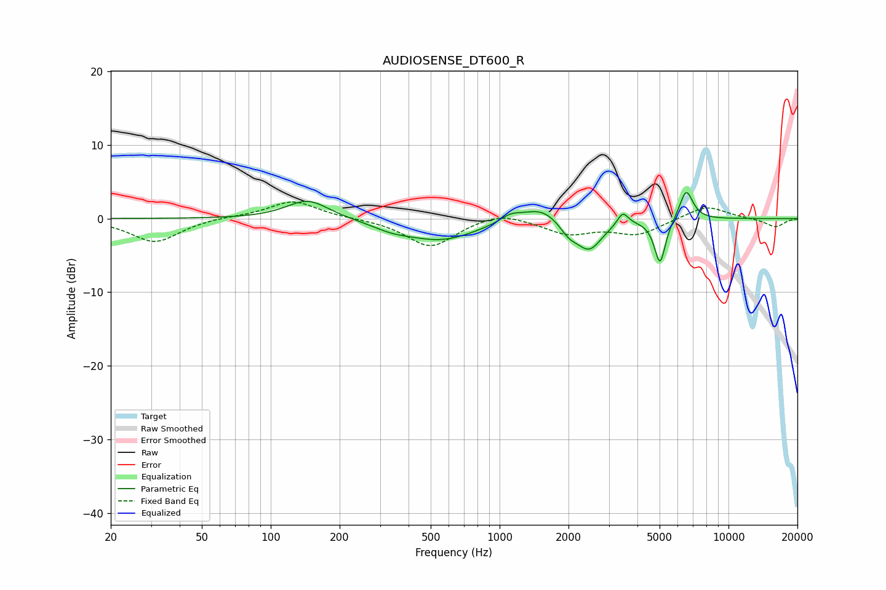

# AUDIOSENSE_DT600_R
See [usage instructions](https://github.com/jaakkopasanen/AutoEq#usage) for more options and info.

### Parametric EQs
Apply preamp of -3.6 dB when using parametric equalizer.

|   # | Type    |   Fc (Hz) |    Q |   Gain (dB) |
|-----|---------|-----------|------|-------------|
|   1 | Peaking |       145 | 1.52 |         2.6 |
|   2 | Peaking |       338 | 1.7  |        -0.8 |
|   3 | Peaking |       554 | 0.89 |        -2.8 |
|   4 | Peaking |      1116 | 2.92 |         1   |
|   5 | Peaking |      1523 | 1.76 |         2   |
|   6 | Peaking |      2001 | 3.6  |        -1.5 |
|   7 | Peaking |      2461 | 2.47 |        -4.1 |
|   8 | Peaking |      3452 | 5.98 |         1.8 |
|   9 | Peaking |      5020 | 5.66 |        -6.1 |
|  10 | Peaking |      6531 | 4.65 |         4.1 |

### Fixed Band EQs
When using fixed band (also called graphic) equalizer, apply preamp of **-2.3 dB** (if available) and set gains manually with these parameters.

|   # | Type    |   Fc (Hz) |    Q |   Gain (dB) |
|-----|---------|-----------|------|-------------|
|   1 | Peaking |        31 | 1.41 |        -3.2 |
|   2 | Peaking |        62 | 1.41 |         0.2 |
|   3 | Peaking |       125 | 1.41 |         2.4 |
|   4 | Peaking |       250 | 1.41 |         0   |
|   5 | Peaking |       500 | 1.41 |        -3.9 |
|   6 | Peaking |      1000 | 1.41 |         1.1 |
|   7 | Peaking |      2000 | 1.41 |        -2   |
|   8 | Peaking |      4000 | 1.41 |        -2.1 |
|   9 | Peaking |      8000 | 1.41 |         1.8 |
|  10 | Peaking |     16000 | 1.41 |        -1.2 |

### Graphs

