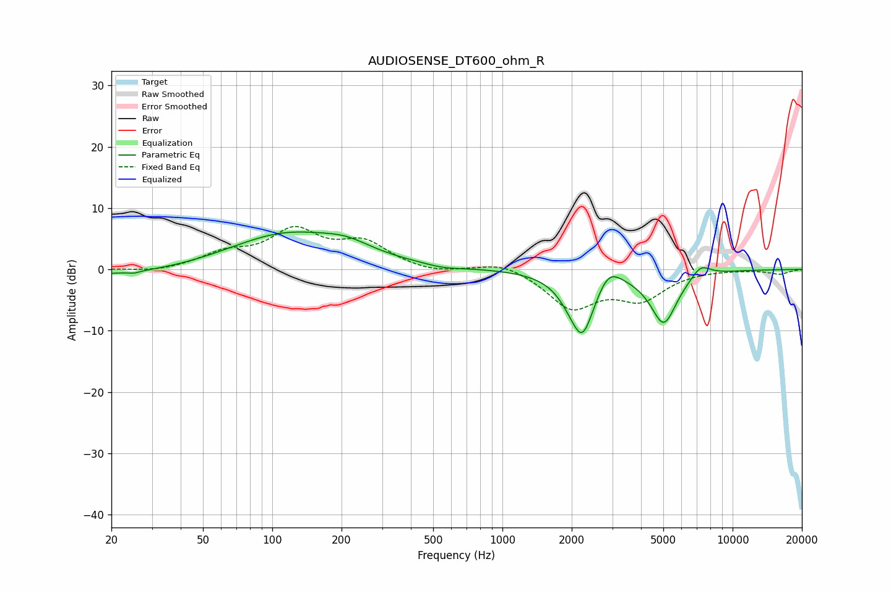

# AUDIOSENSE_DT600_ohm_R
See [usage instructions](https://github.com/jaakkopasanen/AutoEq#usage) for more options and info.

### Parametric EQs
Apply preamp of -6.2 dB when using parametric equalizer.

|   # | Type    |   Fc (Hz) |    Q |   Gain (dB) |
|-----|---------|-----------|------|-------------|
|   1 | Peaking |        25 | 5.95 |        -0.3 |
|   2 | Peaking |        26 | 0.35 |        -1.3 |
|   3 | Peaking |       115 | 0.53 |         6.1 |
|   4 | Peaking |       211 | 1.38 |         1.5 |
|   5 | Peaking |       557 | 1.82 |        -0.5 |
|   6 | Peaking |      1956 | 2.93 |        -0.9 |
|   7 | Peaking |      2225 | 2.46 |       -10.5 |
|   8 | Peaking |      2886 | 2.61 |         3.4 |
|   9 | Peaking |      5022 | 2.37 |        -8.6 |
|  10 | Peaking |      7262 | 3.21 |         2   |

### Fixed Band EQs
When using fixed band (also called graphic) equalizer, apply preamp of **-7.1 dB** (if available) and set gains manually with these parameters.

|   # | Type    |   Fc (Hz) |    Q |   Gain (dB) |
|-----|---------|-----------|------|-------------|
|   1 | Peaking |        31 | 1.41 |        -0.5 |
|   2 | Peaking |        62 | 1.41 |         2.3 |
|   3 | Peaking |       125 | 1.41 |         5.9 |
|   4 | Peaking |       250 | 1.41 |         4   |
|   5 | Peaking |       500 | 1.41 |        -0.8 |
|   6 | Peaking |      1000 | 1.41 |         1.4 |
|   7 | Peaking |      2000 | 1.41 |        -6.1 |
|   8 | Peaking |      4000 | 1.41 |        -4.4 |
|   9 | Peaking |      8000 | 1.41 |         0.1 |
|  10 | Peaking |     16000 | 1.41 |        -0.7 |

### Graphs

