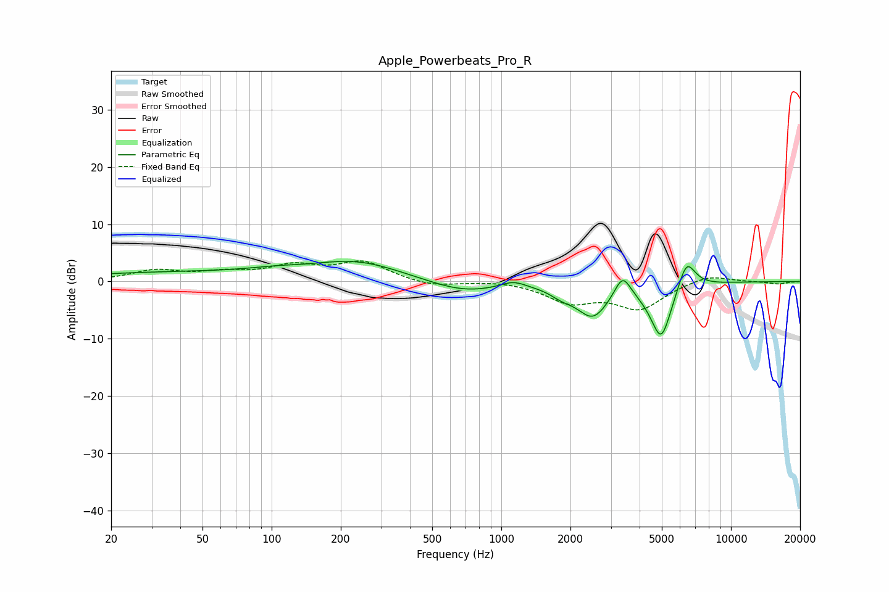

# Apple_Powerbeats_Pro_R
See [usage instructions](https://github.com/jaakkopasanen/AutoEq#usage) for more options and info.

### Parametric EQs
Apply preamp of -3.6 dB when using parametric equalizer.

|   # | Type    |   Fc (Hz) |    Q |   Gain (dB) |
|-----|---------|-----------|------|-------------|
|   1 | Peaking |        40 | 0.28 |         1.6 |
|   2 | Peaking |       103 | 1.27 |         0.5 |
|   3 | Peaking |       236 | 0.71 |         3.2 |
|   4 | Peaking |       684 | 0.91 |        -2.1 |
|   5 | Peaking |      1126 | 2.62 |         1.2 |
|   6 | Peaking |      1828 | 2.91 |        -1.1 |
|   7 | Peaking |      2502 | 1.96 |        -5.8 |
|   8 | Peaking |      3373 | 3.98 |         4   |
|   9 | Peaking |      4966 | 2.86 |       -10   |
|  10 | Peaking |      6401 | 3.5  |         5.5 |

### Fixed Band EQs
When using fixed band (also called graphic) equalizer, apply preamp of **-3.7 dB** (if available) and set gains manually with these parameters.

|   # | Type    |   Fc (Hz) |    Q |   Gain (dB) |
|-----|---------|-----------|------|-------------|
|   1 | Peaking |        31 | 1.41 |         1.8 |
|   2 | Peaking |        62 | 1.41 |         1.3 |
|   3 | Peaking |       125 | 1.41 |         2.4 |
|   4 | Peaking |       250 | 1.41 |         3.3 |
|   5 | Peaking |       500 | 1.41 |        -1   |
|   6 | Peaking |      1000 | 1.41 |         0.3 |
|   7 | Peaking |      2000 | 1.41 |        -3.3 |
|   8 | Peaking |      4000 | 1.41 |        -4.5 |
|   9 | Peaking |      8000 | 1.41 |         1.3 |
|  10 | Peaking |     16000 | 1.41 |        -0.4 |

### Graphs

