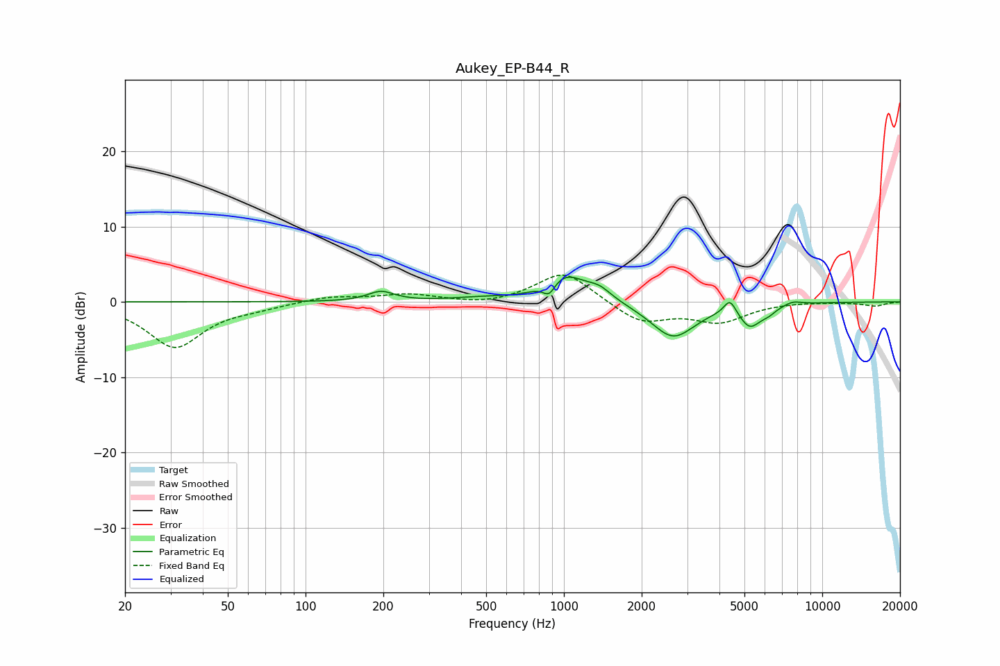

# Aukey_EP-B44_R
See [usage instructions](https://github.com/jaakkopasanen/AutoEq#usage) for more options and info.

### Parametric EQs
Apply preamp of -3.4 dB when using parametric equalizer.

|   # | Type    |   Fc (Hz) |    Q |   Gain (dB) |
|-----|---------|-----------|------|-------------|
|   1 | Peaking |       196 | 2.76 |         1.3 |
|   2 | Peaking |       460 | 1.35 |         0.4 |
|   3 | Peaking |       877 | 6    |        -1.7 |
|   4 | Peaking |      1012 | 1.77 |         3.6 |
|   5 | Peaking |      1373 | 2.88 |         1.3 |
|   6 | Peaking |      2647 | 1.65 |        -4.7 |
|   7 | Peaking |      4395 | 6    |         2   |
|   8 | Peaking |      5250 | 3.35 |        -2.8 |
|   9 | Peaking |      6187 | 4.3  |        -0.7 |
|  10 | Peaking |      7696 | 3.85 |         0.5 |

### Fixed Band EQs
When using fixed band (also called graphic) equalizer, apply preamp of **-3.6 dB** (if available) and set gains manually with these parameters.

|   # | Type    |   Fc (Hz) |    Q |   Gain (dB) |
|-----|---------|-----------|------|-------------|
|   1 | Peaking |        31 | 1.41 |        -6   |
|   2 | Peaking |        62 | 1.41 |        -0.6 |
|   3 | Peaking |       125 | 1.41 |         0.7 |
|   4 | Peaking |       250 | 1.41 |         1   |
|   5 | Peaking |       500 | 1.41 |        -0.5 |
|   6 | Peaking |      1000 | 1.41 |         4.2 |
|   7 | Peaking |      2000 | 1.41 |        -2.8 |
|   8 | Peaking |      4000 | 1.41 |        -2.5 |
|   9 | Peaking |      8000 | 1.41 |         0.1 |
|  10 | Peaking |     16000 | 1.41 |        -0.5 |

### Graphs

