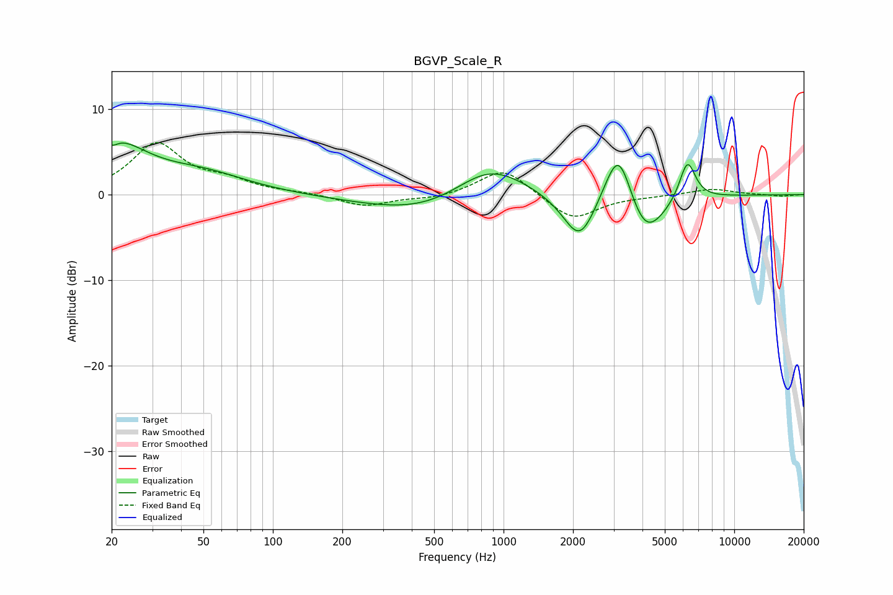

# BGVP_Scale_R
See [usage instructions](https://github.com/jaakkopasanen/AutoEq#usage) for more options and info.

### Parametric EQs
Apply preamp of -6.1 dB when using parametric equalizer.

|   # | Type    |   Fc (Hz) |    Q |   Gain (dB) |
|-----|---------|-----------|------|-------------|
|   1 | Peaking |        20 | 0.97 |         5.9 |
|   2 | Peaking |        20 | 5.95 |         3.2 |
|   3 | Peaking |        20 | 5.87 |        -4   |
|   4 | Peaking |        50 | 0.73 |         2.1 |
|   5 | Peaking |       577 | 0.49 |        -3.5 |
|   6 | Peaking |       860 | 0.81 |         5.7 |
|   7 | Peaking |      2140 | 1.96 |        -5.8 |
|   8 | Peaking |      3152 | 2.24 |         8   |
|   9 | Peaking |      4094 | 1.64 |        -5.9 |
|  10 | Peaking |      6267 | 3.91 |         4.8 |

### Fixed Band EQs
When using fixed band (also called graphic) equalizer, apply preamp of **-6.2 dB** (if available) and set gains manually with these parameters.

|   # | Type    |   Fc (Hz) |    Q |   Gain (dB) |
|-----|---------|-----------|------|-------------|
|   1 | Peaking |        31 | 1.41 |         5.8 |
|   2 | Peaking |        62 | 1.41 |         1.3 |
|   3 | Peaking |       125 | 1.41 |         0.2 |
|   4 | Peaking |       250 | 1.41 |        -1.4 |
|   5 | Peaking |       500 | 1.41 |        -0.5 |
|   6 | Peaking |      1000 | 1.41 |         3.2 |
|   7 | Peaking |      2000 | 1.41 |        -3   |
|   8 | Peaking |      4000 | 1.41 |        -0.1 |
|   9 | Peaking |      8000 | 1.41 |         0.7 |
|  10 | Peaking |     16000 | 1.41 |        -0.2 |

### Graphs

