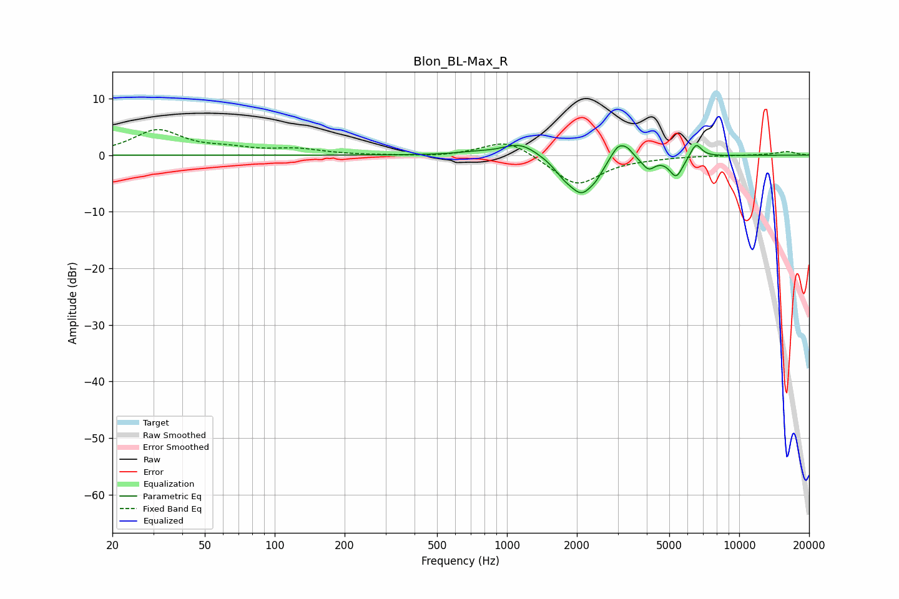

# Blon_BL-Max_R
See [usage instructions](https://github.com/jaakkopasanen/AutoEq#usage) for more options and info.

### Parametric EQs
Apply preamp of -1.8 dB when using parametric equalizer.

|   # | Type    |   Fc (Hz) |    Q |   Gain (dB) |
|-----|---------|-----------|------|-------------|
|   1 | Peaking |       721 | 1.84 |         0.4 |
|   2 | Peaking |      1142 | 1.86 |         2.4 |
|   3 | Peaking |      1742 | 3.64 |        -1.3 |
|   4 | Peaking |      2100 | 2.3  |        -6.6 |
|   5 | Peaking |      2429 | 5.75 |        -0.7 |
|   6 | Peaking |      3021 | 4.09 |         3   |
|   7 | Peaking |      3318 | 6    |         1   |
|   8 | Peaking |      4070 | 5.03 |        -2.1 |
|   9 | Peaking |      5357 | 4.68 |        -3.7 |
|  10 | Peaking |      6513 | 5.71 |         2.5 |

### Fixed Band EQs
When using fixed band (also called graphic) equalizer, apply preamp of **-4.6 dB** (if available) and set gains manually with these parameters.

|   # | Type    |   Fc (Hz) |    Q |   Gain (dB) |
|-----|---------|-----------|------|-------------|
|   1 | Peaking |        31 | 1.41 |         4.3 |
|   2 | Peaking |        62 | 1.41 |         0.9 |
|   3 | Peaking |       125 | 1.41 |         0.9 |
|   4 | Peaking |       250 | 1.41 |        -0   |
|   5 | Peaking |       500 | 1.41 |        -0.3 |
|   6 | Peaking |      1000 | 1.41 |         2.9 |
|   7 | Peaking |      2000 | 1.41 |        -5.4 |
|   8 | Peaking |      4000 | 1.41 |        -0.3 |
|   9 | Peaking |      8000 | 1.41 |        -0   |
|  10 | Peaking |     16000 | 1.41 |         0.6 |

### Graphs

