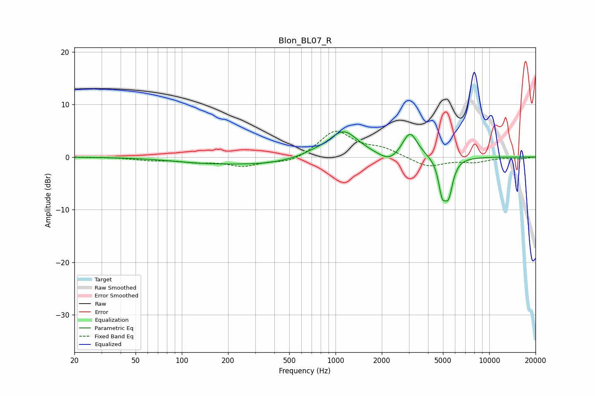

# Blon_BL07_R
See [usage instructions](https://github.com/jaakkopasanen/AutoEq#usage) for more options and info.

### Parametric EQs
Apply preamp of -4.9 dB when using parametric equalizer.

|   # | Type    |   Fc (Hz) |    Q |   Gain (dB) |
|-----|---------|-----------|------|-------------|
|   1 | Peaking |       143 | 0.59 |        -1   |
|   2 | Peaking |       295 | 0.2  |         0.1 |
|   3 | Peaking |       355 | 0.67 |        -1.1 |
|   4 | Peaking |       718 | 2.09 |         0.4 |
|   5 | Peaking |      1126 | 1.47 |         5   |
|   6 | Peaking |      2243 | 2.16 |        -1.8 |
|   7 | Peaking |      3051 | 2.87 |         4.8 |
|   8 | Peaking |      4386 | 6    |         0   |
|   9 | Peaking |      4934 | 5.99 |        -5.4 |
|  10 | Peaking |      5436 | 4.97 |        -6.4 |

### Fixed Band EQs
When using fixed band (also called graphic) equalizer, apply preamp of **-5.0 dB** (if available) and set gains manually with these parameters.

|   # | Type    |   Fc (Hz) |    Q |   Gain (dB) |
|-----|---------|-----------|------|-------------|
|   1 | Peaking |        31 | 1.41 |         0   |
|   2 | Peaking |        62 | 1.41 |        -0.5 |
|   3 | Peaking |       125 | 1.41 |        -0.8 |
|   4 | Peaking |       250 | 1.41 |        -1.6 |
|   5 | Peaking |       500 | 1.41 |        -1.2 |
|   6 | Peaking |      1000 | 1.41 |         5   |
|   7 | Peaking |      2000 | 1.41 |         1.4 |
|   8 | Peaking |      4000 | 1.41 |        -1.9 |
|   9 | Peaking |      8000 | 1.41 |        -0.9 |
|  10 | Peaking |     16000 | 1.41 |        -0.3 |

### Graphs

