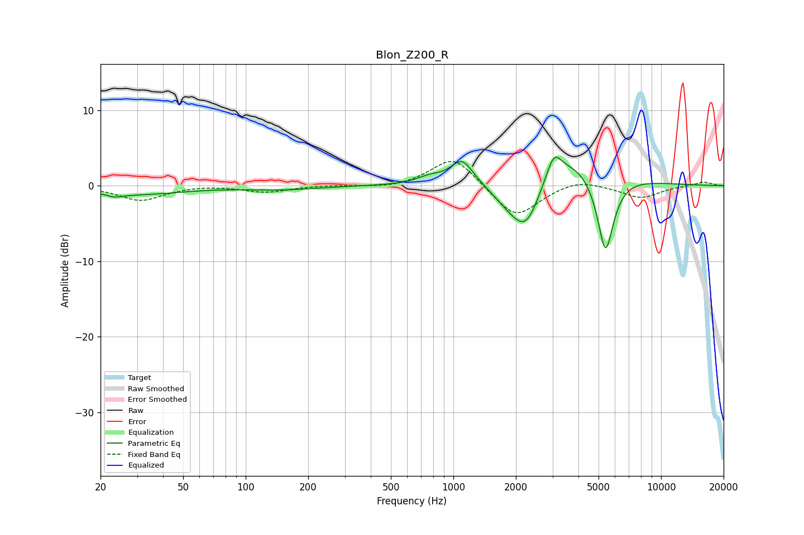

# Blon_Z200_R
See [usage instructions](https://github.com/jaakkopasanen/AutoEq#usage) for more options and info.

### Parametric EQs
Apply preamp of -3.9 dB when using parametric equalizer.

|   # | Type    |   Fc (Hz) |    Q |   Gain (dB) |
|-----|---------|-----------|------|-------------|
|   1 | Peaking |        23 | 3.65 |        -0.5 |
|   2 | Peaking |        30 | 0.64 |        -1.1 |
|   3 | Peaking |       149 | 0.85 |        -0.5 |
|   4 | Peaking |       771 | 2.22 |         0.9 |
|   5 | Peaking |      1100 | 2.62 |         3.3 |
|   6 | Peaking |      1843 | 1.67 |        -2.2 |
|   7 | Peaking |      2246 | 1.98 |        -6.4 |
|   8 | Peaking |      3049 | 4.15 |         2.9 |
|   9 | Peaking |      3515 | 0.71 |         4.6 |
|  10 | Peaking |      5399 | 3.35 |       -11   |

### Fixed Band EQs
When using fixed band (also called graphic) equalizer, apply preamp of **-3.3 dB** (if available) and set gains manually with these parameters.

|   # | Type    |   Fc (Hz) |    Q |   Gain (dB) |
|-----|---------|-----------|------|-------------|
|   1 | Peaking |        31 | 1.41 |        -1.9 |
|   2 | Peaking |        62 | 1.41 |         0.2 |
|   3 | Peaking |       125 | 1.41 |        -0.8 |
|   4 | Peaking |       250 | 1.41 |         0.1 |
|   5 | Peaking |       500 | 1.41 |        -0.4 |
|   6 | Peaking |      1000 | 1.41 |         4   |
|   7 | Peaking |      2000 | 1.41 |        -4.4 |
|   8 | Peaking |      4000 | 1.41 |         1   |
|   9 | Peaking |      8000 | 1.41 |        -1.6 |
|  10 | Peaking |     16000 | 1.41 |         0.5 |

### Graphs

