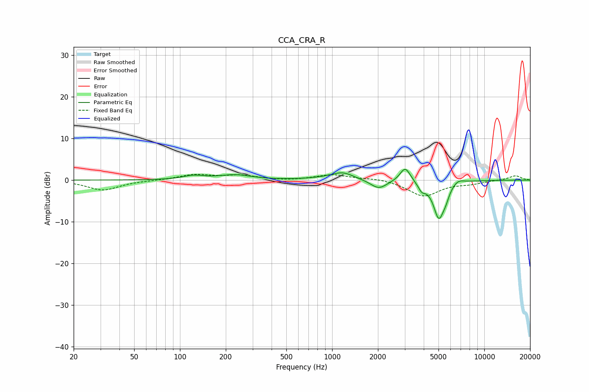

# CCA_CRA_R
See [usage instructions](https://github.com/jaakkopasanen/AutoEq#usage) for more options and info.

### Parametric EQs
Apply preamp of -2.7 dB when using parametric equalizer.

|   # | Type    |   Fc (Hz) |    Q |   Gain (dB) |
|-----|---------|-----------|------|-------------|
|   1 | Peaking |       122 | 2.05 |         0.9 |
|   2 | Peaking |       230 | 1.35 |         1.2 |
|   3 | Peaking |       885 | 1.29 |         0.3 |
|   4 | Peaking |      1173 | 1.97 |         1.7 |
|   5 | Peaking |      2024 | 2.64 |        -2.2 |
|   6 | Peaking |      3023 | 4.19 |         3.5 |
|   7 | Peaking |      3882 | 5.99 |        -1.7 |
|   8 | Peaking |      5027 | 3.77 |        -8.8 |
|   9 | Peaking |      5584 | 5.99 |        -1.6 |
|  10 | Peaking |      6689 | 3.44 |         1.1 |

### Fixed Band EQs
When using fixed band (also called graphic) equalizer, apply preamp of **-1.5 dB** (if available) and set gains manually with these parameters.

|   # | Type    |   Fc (Hz) |    Q |   Gain (dB) |
|-----|---------|-----------|------|-------------|
|   1 | Peaking |        31 | 1.41 |        -2.4 |
|   2 | Peaking |        62 | 1.41 |        -0.1 |
|   3 | Peaking |       125 | 1.41 |         1.3 |
|   4 | Peaking |       250 | 1.41 |         1   |
|   5 | Peaking |       500 | 1.41 |        -0.2 |
|   6 | Peaking |      1000 | 1.41 |         1.3 |
|   7 | Peaking |      2000 | 1.41 |         0.5 |
|   8 | Peaking |      4000 | 1.41 |        -3.8 |
|   9 | Peaking |      8000 | 1.41 |        -0.7 |
|  10 | Peaking |     16000 | 1.41 |         1.1 |

### Graphs

