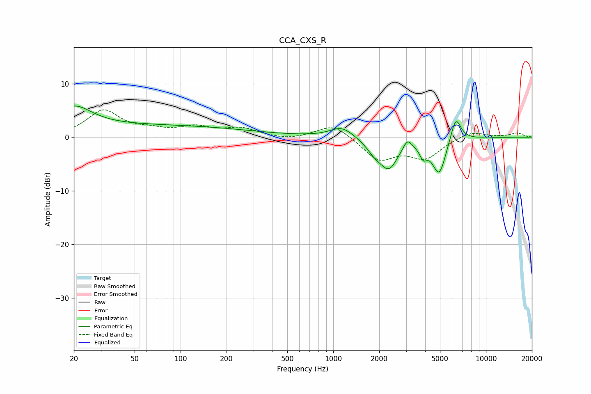

# CCA_CXS_R
See [usage instructions](https://github.com/jaakkopasanen/AutoEq#usage) for more options and info.

### Parametric EQs
Apply preamp of -5.9 dB when using parametric equalizer.

|   # | Type    |   Fc (Hz) |    Q |   Gain (dB) |
|-----|---------|-----------|------|-------------|
|   1 | Peaking |        20 | 1.24 |         4.1 |
|   2 | Peaking |        59 | 0.19 |         2.2 |
|   3 | Peaking |      1136 | 1.87 |         2   |
|   4 | Peaking |      1871 | 2.61 |        -2   |
|   5 | Peaking |      2320 | 2.4  |        -5.2 |
|   6 | Peaking |      3059 | 5.36 |         1.8 |
|   7 | Peaking |      3889 | 5.77 |        -2.2 |
|   8 | Peaking |      4938 | 3.08 |        -6.8 |
|   9 | Peaking |      6338 | 4.01 |         4.8 |
|  10 | Peaking |     10000 | 6    |         0.1 |

### Fixed Band EQs
When using fixed band (also called graphic) equalizer, apply preamp of **-5.2 dB** (if available) and set gains manually with these parameters.

|   # | Type    |   Fc (Hz) |    Q |   Gain (dB) |
|-----|---------|-----------|------|-------------|
|   1 | Peaking |        31 | 1.41 |         4.9 |
|   2 | Peaking |        62 | 1.41 |         1   |
|   3 | Peaking |       125 | 1.41 |         1.7 |
|   4 | Peaking |       250 | 1.41 |         1.5 |
|   5 | Peaking |       500 | 1.41 |        -0.6 |
|   6 | Peaking |      1000 | 1.41 |         2.6 |
|   7 | Peaking |      2000 | 1.41 |        -4.1 |
|   8 | Peaking |      4000 | 1.41 |        -3.7 |
|   9 | Peaking |      8000 | 1.41 |         1.2 |
|  10 | Peaking |     16000 | 1.41 |         0.8 |

### Graphs

