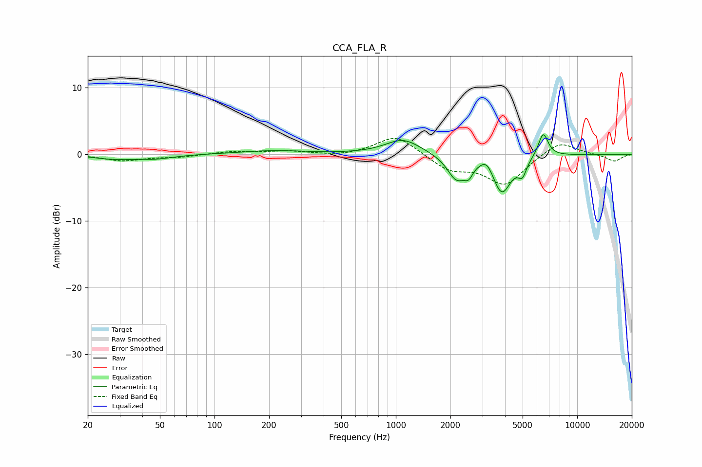

# CCA_FLA_R
See [usage instructions](https://github.com/jaakkopasanen/AutoEq#usage) for more options and info.

### Parametric EQs
Apply preamp of -3.0 dB when using parametric equalizer.

|   # | Type    |   Fc (Hz) |    Q |   Gain (dB) |
|-----|---------|-----------|------|-------------|
|   1 | Peaking |        28 | 1.25 |        -0.6 |
|   2 | Peaking |        47 | 1.41 |        -0.6 |
|   3 | Peaking |       210 | 0.78 |         0.5 |
|   4 | Peaking |      1095 | 1.47 |         2.3 |
|   5 | Peaking |      2159 | 2.78 |        -3.6 |
|   6 | Peaking |      2521 | 6    |        -1.6 |
|   7 | Peaking |      3180 | 4.1  |         1.6 |
|   8 | Peaking |      3838 | 2.73 |        -5.8 |
|   9 | Peaking |      4981 | 6    |        -2.2 |
|  10 | Peaking |      6495 | 5.07 |         3.6 |

### Fixed Band EQs
When using fixed band (also called graphic) equalizer, apply preamp of **-2.5 dB** (if available) and set gains manually with these parameters.

|   # | Type    |   Fc (Hz) |    Q |   Gain (dB) |
|-----|---------|-----------|------|-------------|
|   1 | Peaking |        31 | 1.41 |        -0.9 |
|   2 | Peaking |        62 | 1.41 |        -0.4 |
|   3 | Peaking |       125 | 1.41 |         0.4 |
|   4 | Peaking |       250 | 1.41 |         0.5 |
|   5 | Peaking |       500 | 1.41 |        -0.3 |
|   6 | Peaking |      1000 | 1.41 |         2.9 |
|   7 | Peaking |      2000 | 1.41 |        -2.2 |
|   8 | Peaking |      4000 | 1.41 |        -4.5 |
|   9 | Peaking |      8000 | 1.41 |         2.1 |
|  10 | Peaking |     16000 | 1.41 |        -1.1 |

### Graphs

