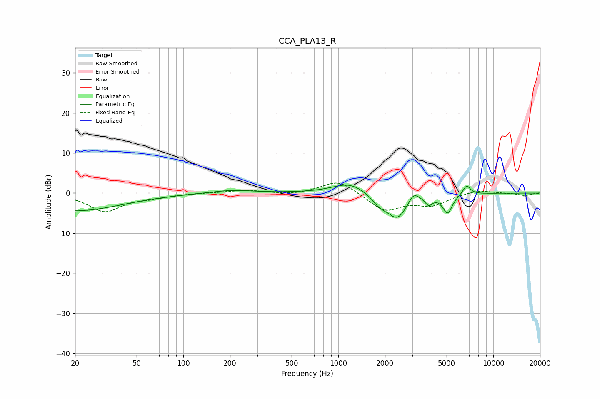

# CCA_PLA13_R
See [usage instructions](https://github.com/jaakkopasanen/AutoEq#usage) for more options and info.

### Parametric EQs
Apply preamp of -2.1 dB when using parametric equalizer.

|   # | Type    |   Fc (Hz) |    Q |   Gain (dB) |
|-----|---------|-----------|------|-------------|
|   1 | Peaking |        20 | 0.47 |        -4.4 |
|   2 | Peaking |       206 | 1.06 |         0.8 |
|   3 | Peaking |      1199 | 1.29 |         3   |
|   4 | Peaking |      1417 | 1.2  |        -0.4 |
|   5 | Peaking |      1847 | 2.81 |        -2.2 |
|   6 | Peaking |      2405 | 2.16 |        -6.1 |
|   7 | Peaking |      3061 | 4.29 |         2.4 |
|   8 | Peaking |      3836 | 6    |        -2   |
|   9 | Peaking |      5068 | 4.47 |        -4.7 |
|  10 | Peaking |      6728 | 5.63 |         2.4 |

### Fixed Band EQs
When using fixed band (also called graphic) equalizer, apply preamp of **-2.6 dB** (if available) and set gains manually with these parameters.

|   # | Type    |   Fc (Hz) |    Q |   Gain (dB) |
|-----|---------|-----------|------|-------------|
|   1 | Peaking |        31 | 1.41 |        -4.5 |
|   2 | Peaking |        62 | 1.41 |        -0.9 |
|   3 | Peaking |       125 | 1.41 |         0   |
|   4 | Peaking |       250 | 1.41 |         0.8 |
|   5 | Peaking |       500 | 1.41 |        -0.5 |
|   6 | Peaking |      1000 | 1.41 |         3.4 |
|   7 | Peaking |      2000 | 1.41 |        -4.4 |
|   8 | Peaking |      4000 | 1.41 |        -2.8 |
|   9 | Peaking |      8000 | 1.41 |         0.9 |
|  10 | Peaking |     16000 | 1.41 |        -0.6 |

### Graphs

