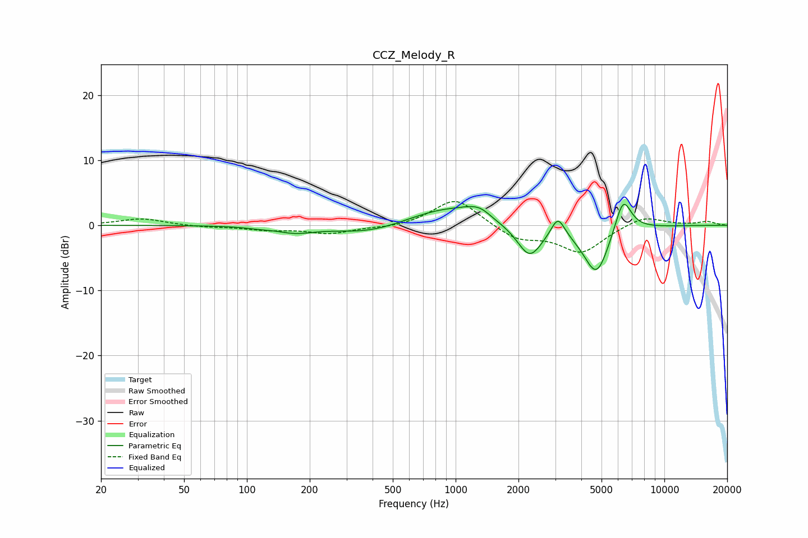

# CCZ_Melody_R
See [usage instructions](https://github.com/jaakkopasanen/AutoEq#usage) for more options and info.

### Parametric EQs
Apply preamp of -3.3 dB when using parametric equalizer.

|   # | Type    |   Fc (Hz) |    Q |   Gain (dB) |
|-----|---------|-----------|------|-------------|
|   1 | Peaking |       114 | 2.24 |        -0.2 |
|   2 | Peaking |       170 | 1.63 |        -1   |
|   3 | Peaking |       385 | 0.84 |        -1.4 |
|   4 | Peaking |       904 | 0.78 |         2.7 |
|   5 | Peaking |      1215 | 2.3  |         0.9 |
|   6 | Peaking |      1340 | 3.34 |         0.6 |
|   7 | Peaking |      2260 | 2.35 |        -5   |
|   8 | Peaking |      3091 | 4.39 |         3.1 |
|   9 | Peaking |      4730 | 2.22 |        -7.8 |
|  10 | Peaking |      6337 | 3.38 |         5.7 |

### Fixed Band EQs
When using fixed band (also called graphic) equalizer, apply preamp of **-3.7 dB** (if available) and set gains manually with these parameters.

|   # | Type    |   Fc (Hz) |    Q |   Gain (dB) |
|-----|---------|-----------|------|-------------|
|   1 | Peaking |        31 | 1.41 |         1   |
|   2 | Peaking |        62 | 1.41 |        -0.3 |
|   3 | Peaking |       125 | 1.41 |        -0.6 |
|   4 | Peaking |       250 | 1.41 |        -1.2 |
|   5 | Peaking |       500 | 1.41 |        -0.4 |
|   6 | Peaking |      1000 | 1.41 |         4.3 |
|   7 | Peaking |      2000 | 1.41 |        -2.1 |
|   8 | Peaking |      4000 | 1.41 |        -4.1 |
|   9 | Peaking |      8000 | 1.41 |         1.5 |
|  10 | Peaking |     16000 | 1.41 |         0.6 |

### Graphs

