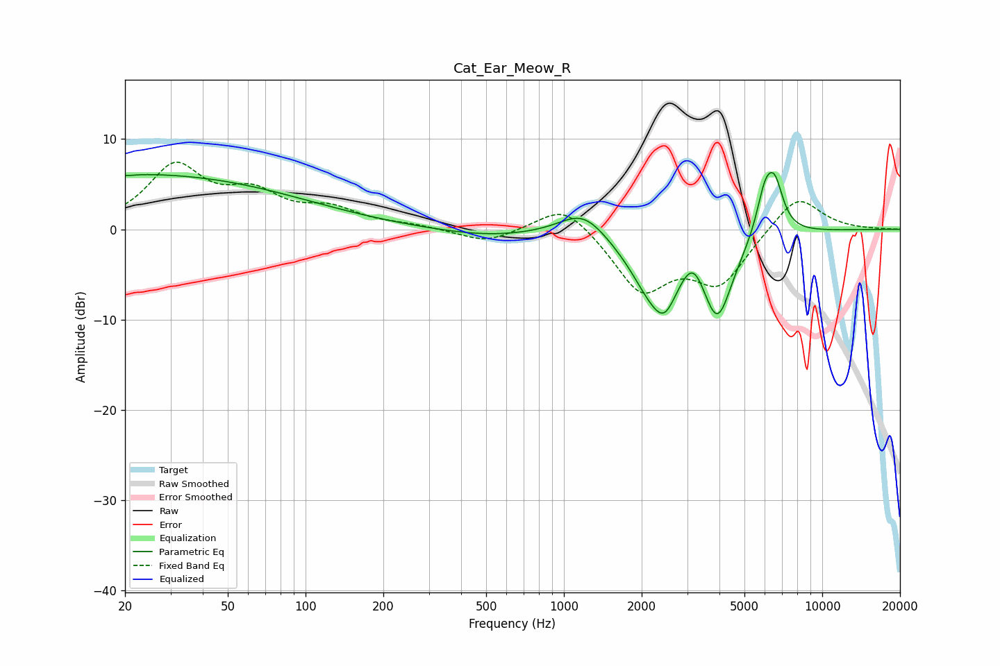

# Cat_Ear_Meow_R
See [usage instructions](https://github.com/jaakkopasanen/AutoEq#usage) for more options and info.

### Parametric EQs
Apply preamp of -6.4 dB when using parametric equalizer.

|   # | Type    |   Fc (Hz) |    Q |   Gain (dB) |
|-----|---------|-----------|------|-------------|
|   1 | Peaking |        21 | 5.83 |        -0.1 |
|   2 | Peaking |        22 | 0.21 |         6.1 |
|   3 | Peaking |       510 | 0.69 |        -0.8 |
|   4 | Peaking |      1186 | 1.55 |         2.9 |
|   5 | Peaking |      2220 | 1.52 |        -6.5 |
|   6 | Peaking |      2468 | 3.27 |        -2.9 |
|   7 | Peaking |      3165 | 3.26 |         2.7 |
|   8 | Peaking |      3928 | 2.31 |        -9.1 |
|   9 | Peaking |      6008 | 4.02 |         4.7 |
|  10 | Peaking |      6565 | 4.12 |         4.7 |

### Fixed Band EQs
When using fixed band (also called graphic) equalizer, apply preamp of **-7.5 dB** (if available) and set gains manually with these parameters.

|   # | Type    |   Fc (Hz) |    Q |   Gain (dB) |
|-----|---------|-----------|------|-------------|
|   1 | Peaking |        31 | 1.41 |         6.7 |
|   2 | Peaking |        62 | 1.41 |         3.3 |
|   3 | Peaking |       125 | 1.41 |         1.9 |
|   4 | Peaking |       250 | 1.41 |         0.4 |
|   5 | Peaking |       500 | 1.41 |        -1.5 |
|   6 | Peaking |      1000 | 1.41 |         3.2 |
|   7 | Peaking |      2000 | 1.41 |        -6.6 |
|   8 | Peaking |      4000 | 1.41 |        -5.7 |
|   9 | Peaking |      8000 | 1.41 |         4.1 |
|  10 | Peaking |     16000 | 1.41 |         0   |

### Graphs

