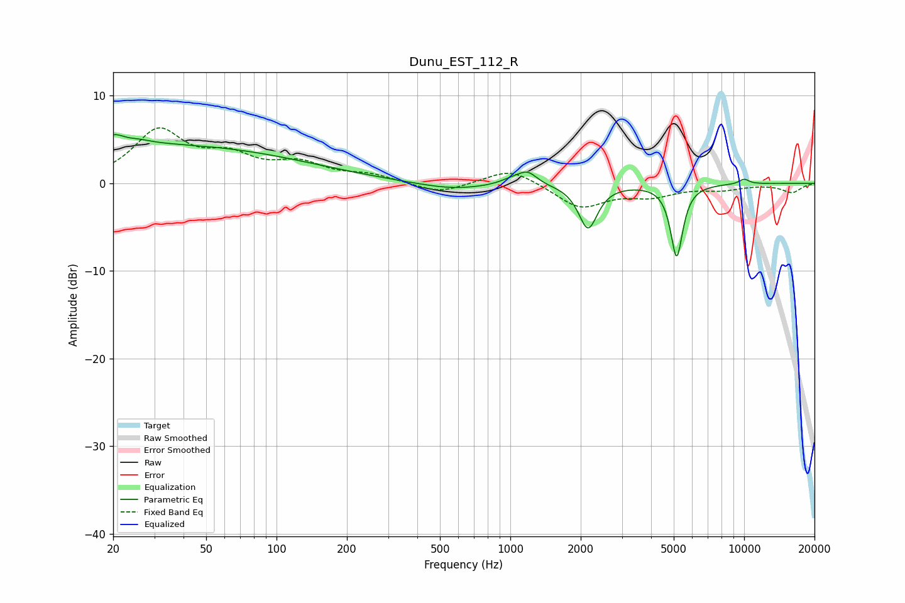

# Dunu_EST_112_R
See [usage instructions](https://github.com/jaakkopasanen/AutoEq#usage) for more options and info.

### Parametric EQs
Apply preamp of -5.7 dB when using parametric equalizer.

|   # | Type    |   Fc (Hz) |    Q |   Gain (dB) |
|-----|---------|-----------|------|-------------|
|   1 | Peaking |        21 | 5.13 |         2.2 |
|   2 | Peaking |        21 | 5.99 |        -1.3 |
|   3 | Peaking |        25 | 2.51 |         0.4 |
|   4 | Peaking |        26 | 0.18 |         4.4 |
|   5 | Peaking |       566 | 0.92 |        -0.8 |
|   6 | Peaking |      1033 | 2.63 |         0.7 |
|   7 | Peaking |      1190 | 3.69 |         1.3 |
|   8 | Peaking |      2150 | 3.53 |        -5.1 |
|   9 | Peaking |      5146 | 5.45 |        -8.3 |
|  10 | Peaking |     10000 | 5.59 |         0.6 |

### Fixed Band EQs
When using fixed band (also called graphic) equalizer, apply preamp of **-6.4 dB** (if available) and set gains manually with these parameters.

|   # | Type    |   Fc (Hz) |    Q |   Gain (dB) |
|-----|---------|-----------|------|-------------|
|   1 | Peaking |        31 | 1.41 |         5.8 |
|   2 | Peaking |        62 | 1.41 |         2.5 |
|   3 | Peaking |       125 | 1.41 |         2   |
|   4 | Peaking |       250 | 1.41 |         0.8 |
|   5 | Peaking |       500 | 1.41 |        -1.2 |
|   6 | Peaking |      1000 | 1.41 |         1.8 |
|   7 | Peaking |      2000 | 1.41 |        -2.8 |
|   8 | Peaking |      4000 | 1.41 |        -1.2 |
|   9 | Peaking |      8000 | 1.41 |        -0.6 |
|  10 | Peaking |     16000 | 1.41 |        -1   |

### Graphs

