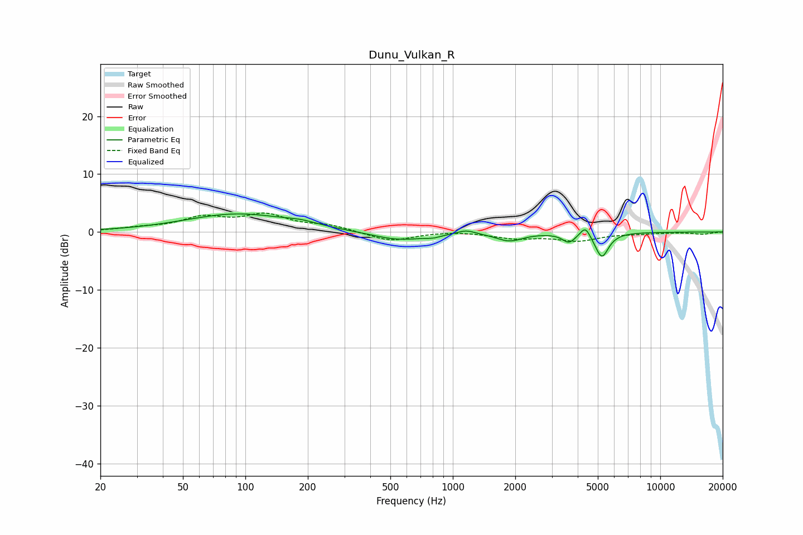

# Dunu_Vulkan_R
See [usage instructions](https://github.com/jaakkopasanen/AutoEq#usage) for more options and info.

### Parametric EQs
Apply preamp of -3.2 dB when using parametric equalizer.

|   # | Type    |   Fc (Hz) |    Q |   Gain (dB) |
|-----|---------|-----------|------|-------------|
|   1 | Peaking |        92 | 0.56 |         3.1 |
|   2 | Peaking |       186 | 1.89 |         0.5 |
|   3 | Peaking |       549 | 1.08 |        -1.5 |
|   4 | Peaking |       804 | 3.95 |        -0.4 |
|   5 | Peaking |      1157 | 3.13 |         0.7 |
|   6 | Peaking |      1877 | 2.2  |        -1.5 |
|   7 | Peaking |      3573 | 3.94 |        -0.3 |
|   8 | Peaking |      3638 | 4.87 |        -1.3 |
|   9 | Peaking |      4355 | 6    |         1.9 |
|  10 | Peaking |      5229 | 4.37 |        -4.3 |

### Fixed Band EQs
When using fixed band (also called graphic) equalizer, apply preamp of **-3.4 dB** (if available) and set gains manually with these parameters.

|   # | Type    |   Fc (Hz) |    Q |   Gain (dB) |
|-----|---------|-----------|------|-------------|
|   1 | Peaking |        31 | 1.41 |         0.5 |
|   2 | Peaking |        62 | 1.41 |         2.3 |
|   3 | Peaking |       125 | 1.41 |         2.7 |
|   4 | Peaking |       250 | 1.41 |         1   |
|   5 | Peaking |       500 | 1.41 |        -1.6 |
|   6 | Peaking |      1000 | 1.41 |         0.2 |
|   7 | Peaking |      2000 | 1.41 |        -1   |
|   8 | Peaking |      4000 | 1.41 |        -1.4 |
|   9 | Peaking |      8000 | 1.41 |        -0.2 |
|  10 | Peaking |     16000 | 1.41 |        -0.4 |

### Graphs

