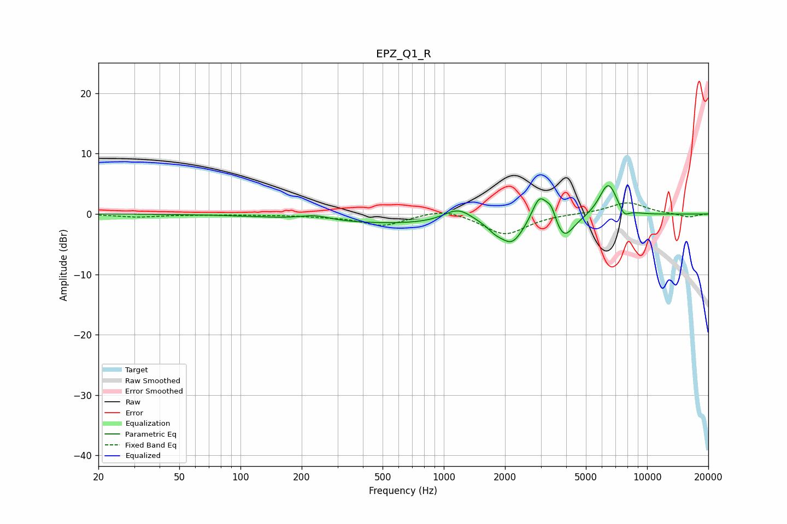

# EPZ_Q1_R
See [usage instructions](https://github.com/jaakkopasanen/AutoEq#usage) for more options and info.

### Parametric EQs
Apply preamp of -4.8 dB when using parametric equalizer.

|   # | Type    |   Fc (Hz) |    Q |   Gain (dB) |
|-----|---------|-----------|------|-------------|
|   1 | Peaking |       233 | 1.95 |         0.8 |
|   2 | Peaking |       948 | 0.19 |        -1.8 |
|   3 | Peaking |      1178 | 1.91 |         2.6 |
|   4 | Peaking |      1788 | 4.04 |        -0.9 |
|   5 | Peaking |      2162 | 2.51 |        -3.7 |
|   6 | Peaking |      2960 | 3.65 |         4.8 |
|   7 | Peaking |      3375 | 5.77 |         2.3 |
|   8 | Peaking |      3893 | 3.05 |        -3.7 |
|   9 | Peaking |      6439 | 2.96 |         5.7 |
|  10 | Peaking |      7704 | 5.43 |        -1.5 |

### Fixed Band EQs
When using fixed band (also called graphic) equalizer, apply preamp of **-1.9 dB** (if available) and set gains manually with these parameters.

|   # | Type    |   Fc (Hz) |    Q |   Gain (dB) |
|-----|---------|-----------|------|-------------|
|   1 | Peaking |        31 | 1.41 |        -0.5 |
|   2 | Peaking |        62 | 1.41 |        -0.1 |
|   3 | Peaking |       125 | 1.41 |        -0.1 |
|   4 | Peaking |       250 | 1.41 |        -0.3 |
|   5 | Peaking |       500 | 1.41 |        -1.9 |
|   6 | Peaking |      1000 | 1.41 |         1.1 |
|   7 | Peaking |      2000 | 1.41 |        -3.4 |
|   8 | Peaking |      4000 | 1.41 |         0   |
|   9 | Peaking |      8000 | 1.41 |         1.9 |
|  10 | Peaking |     16000 | 1.41 |        -0.6 |

### Graphs

