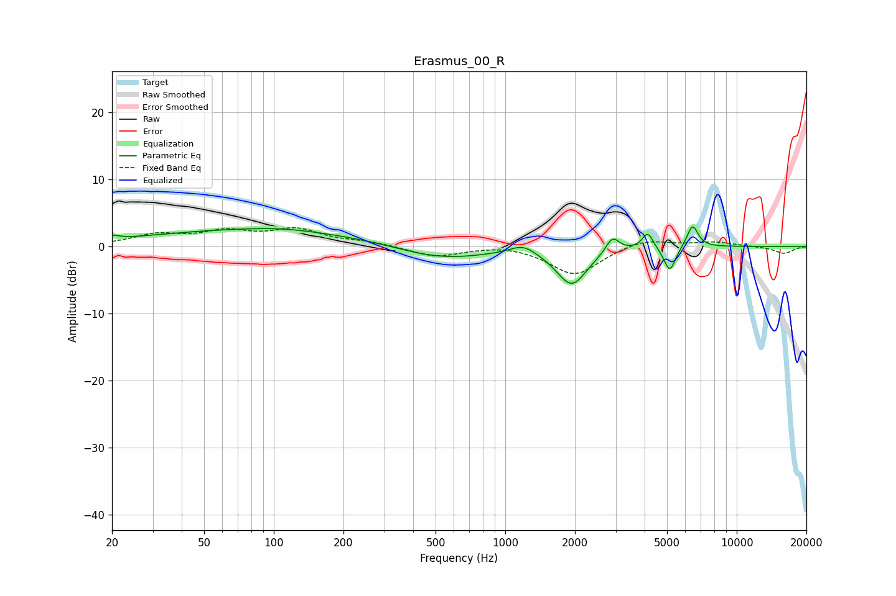

# Erasmus_00_R
See [usage instructions](https://github.com/jaakkopasanen/AutoEq#usage) for more options and info.

### Parametric EQs
Apply preamp of -3.0 dB when using parametric equalizer.

|   # | Type    |   Fc (Hz) |    Q |   Gain (dB) |
|-----|---------|-----------|------|-------------|
|   1 | Peaking |        20 | 4.67 |         0.6 |
|   2 | Peaking |        88 | 0.28 |         2.5 |
|   3 | Peaking |       104 | 1.09 |         0.3 |
|   4 | Peaking |       524 | 0.7  |        -2.1 |
|   5 | Peaking |      1194 | 2.53 |         1.4 |
|   6 | Peaking |      1936 | 2.12 |        -5.6 |
|   7 | Peaking |      2906 | 4.83 |         2.4 |
|   8 | Peaking |      4127 | 6    |         2.4 |
|   9 | Peaking |      5139 | 5.52 |        -3.8 |
|  10 | Peaking |      6444 | 5.68 |         3.4 |

### Fixed Band EQs
When using fixed band (also called graphic) equalizer, apply preamp of **-2.9 dB** (if available) and set gains manually with these parameters.

|   # | Type    |   Fc (Hz) |    Q |   Gain (dB) |
|-----|---------|-----------|------|-------------|
|   1 | Peaking |        31 | 1.41 |         1.6 |
|   2 | Peaking |        62 | 1.41 |         1.9 |
|   3 | Peaking |       125 | 1.41 |         2.3 |
|   4 | Peaking |       250 | 1.41 |         0.6 |
|   5 | Peaking |       500 | 1.41 |        -1.5 |
|   6 | Peaking |      1000 | 1.41 |         0.4 |
|   7 | Peaking |      2000 | 1.41 |        -4.3 |
|   8 | Peaking |      4000 | 1.41 |         1.2 |
|   9 | Peaking |      8000 | 1.41 |         0.6 |
|  10 | Peaking |     16000 | 1.41 |        -1.1 |

### Graphs

