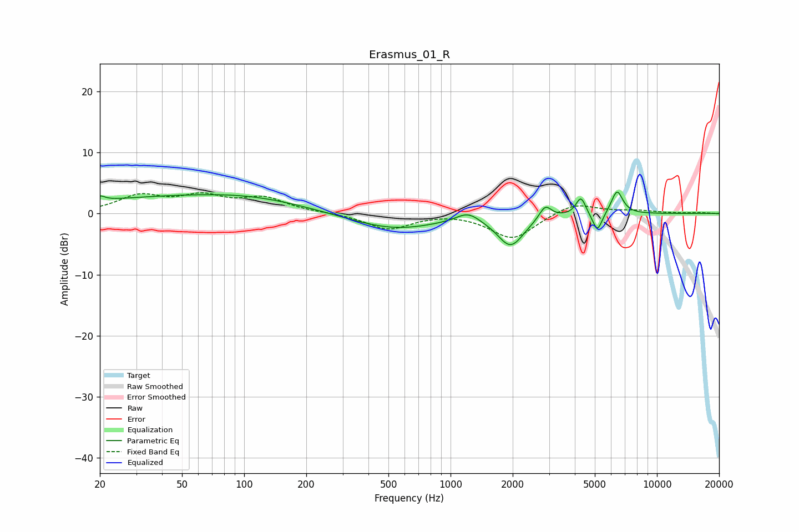

# Erasmus_01_R
See [usage instructions](https://github.com/jaakkopasanen/AutoEq#usage) for more options and info.

### Parametric EQs
Apply preamp of -3.6 dB when using parametric equalizer.

|   # | Type    |   Fc (Hz) |    Q |   Gain (dB) |
|-----|---------|-----------|------|-------------|
|   1 | Peaking |        20 | 5.99 |         0.8 |
|   2 | Peaking |        45 | 0.29 |         2.5 |
|   3 | Peaking |       116 | 0.54 |         1.1 |
|   4 | Peaking |       531 | 0.66 |        -2.6 |
|   5 | Peaking |      1214 | 2.53 |         1.6 |
|   6 | Peaking |      1956 | 2.17 |        -5.1 |
|   7 | Peaking |      2875 | 4.77 |         2.3 |
|   8 | Peaking |      4279 | 6    |         3   |
|   9 | Peaking |      5146 | 5.95 |        -3.2 |
|  10 | Peaking |      6406 | 4.94 |         3.9 |

### Fixed Band EQs
When using fixed band (also called graphic) equalizer, apply preamp of **-3.5 dB** (if available) and set gains manually with these parameters.

|   # | Type    |   Fc (Hz) |    Q |   Gain (dB) |
|-----|---------|-----------|------|-------------|
|   1 | Peaking |        31 | 1.41 |         2.7 |
|   2 | Peaking |        62 | 1.41 |         2.5 |
|   3 | Peaking |       125 | 1.41 |         2.3 |
|   4 | Peaking |       250 | 1.41 |         0.1 |
|   5 | Peaking |       500 | 1.41 |        -2.6 |
|   6 | Peaking |      1000 | 1.41 |         0.2 |
|   7 | Peaking |      2000 | 1.41 |        -4.2 |
|   8 | Peaking |      4000 | 1.41 |         1.9 |
|   9 | Peaking |      8000 | 1.41 |         0.4 |
|  10 | Peaking |     16000 | 1.41 |         0.1 |

### Graphs

