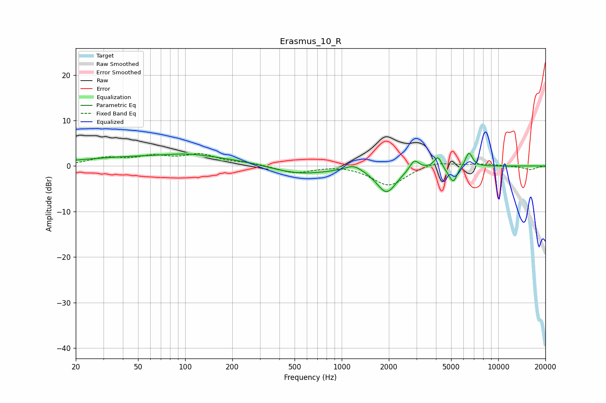

# Erasmus_10_R
See [usage instructions](https://github.com/jaakkopasanen/AutoEq#usage) for more options and info.

### Parametric EQs
Apply preamp of -2.9 dB when using parametric equalizer.

|   # | Type    |   Fc (Hz) |    Q |   Gain (dB) |
|-----|---------|-----------|------|-------------|
|   1 | Peaking |        86 | 0.21 |         2.3 |
|   2 | Peaking |       104 | 1.2  |         0.6 |
|   3 | Peaking |       516 | 0.69 |        -2.3 |
|   4 | Peaking |      1193 | 2.63 |         1.4 |
|   5 | Peaking |      1935 | 2.21 |        -5.7 |
|   6 | Peaking |      2910 | 4.85 |         2.3 |
|   7 | Peaking |      4120 | 6    |         2.6 |
|   8 | Peaking |      4828 | 3.99 |        -0.9 |
|   9 | Peaking |      5179 | 5.94 |        -3   |
|  10 | Peaking |      6497 | 5.94 |         3.2 |

### Fixed Band EQs
When using fixed band (also called graphic) equalizer, apply preamp of **-2.8 dB** (if available) and set gains manually with these parameters.

|   # | Type    |   Fc (Hz) |    Q |   Gain (dB) |
|-----|---------|-----------|------|-------------|
|   1 | Peaking |        31 | 1.41 |         1.6 |
|   2 | Peaking |        62 | 1.41 |         1.8 |
|   3 | Peaking |       125 | 1.41 |         2.3 |
|   4 | Peaking |       250 | 1.41 |         0.6 |
|   5 | Peaking |       500 | 1.41 |        -1.6 |
|   6 | Peaking |      1000 | 1.41 |         0.3 |
|   7 | Peaking |      2000 | 1.41 |        -4.4 |
|   8 | Peaking |      4000 | 1.41 |         1.1 |
|   9 | Peaking |      8000 | 1.41 |         0.4 |
|  10 | Peaking |     16000 | 1.41 |        -0.8 |

### Graphs

