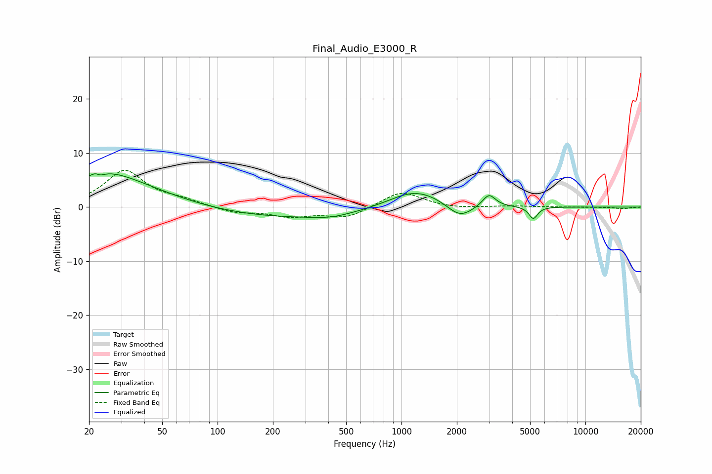

# Final_Audio_E3000_R
See [usage instructions](https://github.com/jaakkopasanen/AutoEq#usage) for more options and info.

### Parametric EQs
Apply preamp of -6.3 dB when using parametric equalizer.

|   # | Type    |   Fc (Hz) |    Q |   Gain (dB) |
|-----|---------|-----------|------|-------------|
|   1 | Peaking |        22 | 5.95 |         3.2 |
|   2 | Peaking |        22 | 5.78 |        -3.2 |
|   3 | Peaking |        25 | 1.13 |         1.5 |
|   4 | Peaking |        27 | 0.51 |         4.9 |
|   5 | Peaking |       254 | 0.3  |        -2   |
|   6 | Peaking |       412 | 1.38 |        -0.6 |
|   7 | Peaking |      1192 | 0.94 |         3.6 |
|   8 | Peaking |      2074 | 2.01 |        -2.7 |
|   9 | Peaking |      2990 | 4.06 |         2.4 |
|  10 | Peaking |      5205 | 6    |        -2.2 |

### Fixed Band EQs
When using fixed band (also called graphic) equalizer, apply preamp of **-6.9 dB** (if available) and set gains manually with these parameters.

|   # | Type    |   Fc (Hz) |    Q |   Gain (dB) |
|-----|---------|-----------|------|-------------|
|   1 | Peaking |        31 | 1.41 |         6.6 |
|   2 | Peaking |        62 | 1.41 |         1   |
|   3 | Peaking |       125 | 1.41 |        -1.1 |
|   4 | Peaking |       250 | 1.41 |        -1.6 |
|   5 | Peaking |       500 | 1.41 |        -2   |
|   6 | Peaking |      1000 | 1.41 |         3   |
|   7 | Peaking |      2000 | 1.41 |        -0.3 |
|   8 | Peaking |      4000 | 1.41 |         0.2 |
|   9 | Peaking |      8000 | 1.41 |        -0   |
|  10 | Peaking |     16000 | 1.41 |        -0.3 |

### Graphs

