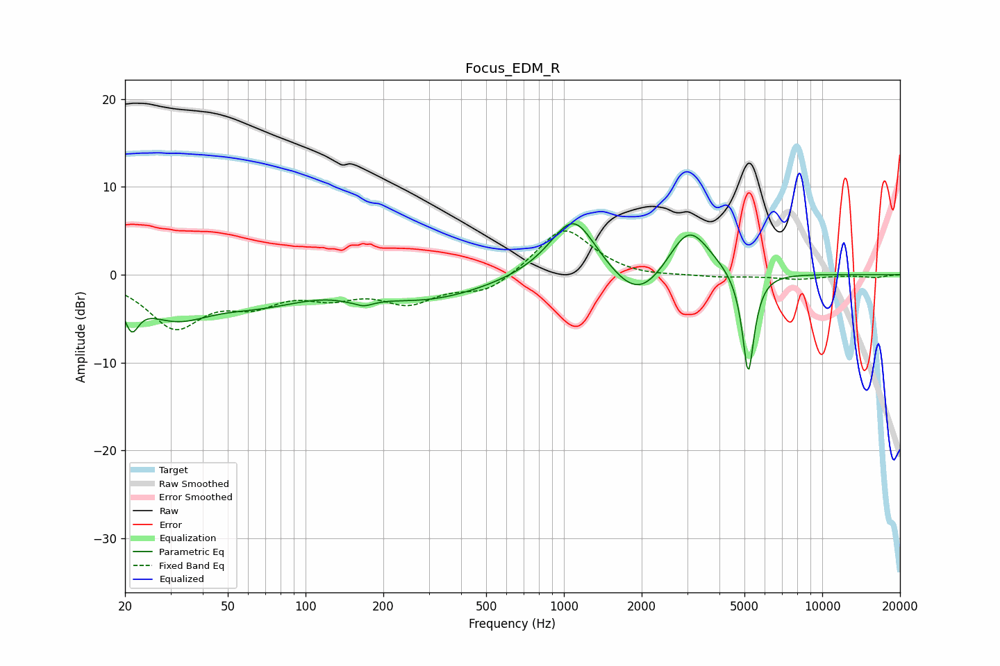

# Focus_EDM_R
See [usage instructions](https://github.com/jaakkopasanen/AutoEq#usage) for more options and info.

### Parametric EQs
Apply preamp of -5.9 dB when using parametric equalizer.

|   # | Type    |   Fc (Hz) |    Q |   Gain (dB) |
|-----|---------|-----------|------|-------------|
|   1 | Peaking |        21 | 5.17 |        -3.5 |
|   2 | Peaking |        31 | 1    |        -4.1 |
|   3 | Peaking |        67 | 0.76 |        -2.4 |
|   4 | Peaking |       159 | 4.03 |         2.6 |
|   5 | Peaking |       160 | 3.55 |        -3.5 |
|   6 | Peaking |       297 | 0.59 |        -2.7 |
|   7 | Peaking |      1090 | 1.52 |         7.3 |
|   8 | Peaking |      1953 | 1.28 |        -4.3 |
|   9 | Peaking |      3041 | 1.68 |         6.1 |
|  10 | Peaking |      5172 | 5.98 |       -11.9 |

### Fixed Band EQs
When using fixed band (also called graphic) equalizer, apply preamp of **-5.1 dB** (if available) and set gains manually with these parameters.

|   # | Type    |   Fc (Hz) |    Q |   Gain (dB) |
|-----|---------|-----------|------|-------------|
|   1 | Peaking |        31 | 1.41 |        -5.7 |
|   2 | Peaking |        62 | 1.41 |        -2.6 |
|   3 | Peaking |       125 | 1.41 |        -2   |
|   4 | Peaking |       250 | 1.41 |        -2.9 |
|   5 | Peaking |       500 | 1.41 |        -2   |
|   6 | Peaking |      1000 | 1.41 |         5.5 |
|   7 | Peaking |      2000 | 1.41 |        -0.4 |
|   8 | Peaking |      4000 | 1.41 |        -0.3 |
|   9 | Peaking |      8000 | 1.41 |        -0.5 |
|  10 | Peaking |     16000 | 1.41 |        -0.3 |

### Graphs

