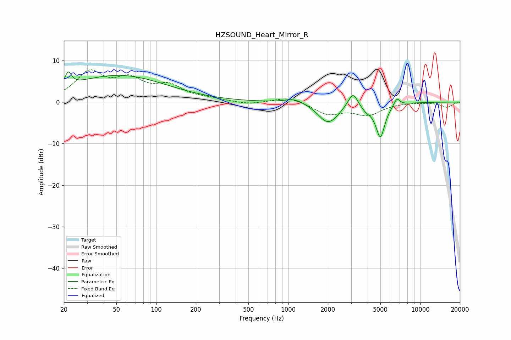

# HZSOUND_Heart_Mirror_R
See [usage instructions](https://github.com/jaakkopasanen/AutoEq#usage) for more options and info.

### Parametric EQs
Apply preamp of -7.4 dB when using parametric equalizer.

|   # | Type    |   Fc (Hz) |    Q |   Gain (dB) |
|-----|---------|-----------|------|-------------|
|   1 | Peaking |        22 | 5.99 |         3.2 |
|   2 | Peaking |        35 | 0.28 |         0.8 |
|   3 | Peaking |        53 | 0.4  |         5.6 |
|   4 | Peaking |      1120 | 2.01 |         1.2 |
|   5 | Peaking |      1983 | 1.93 |        -4.7 |
|   6 | Peaking |      2295 | 3.41 |        -0.6 |
|   7 | Peaking |      3099 | 4.02 |         3.6 |
|   8 | Peaking |      3899 | 3.45 |        -1.3 |
|   9 | Peaking |      4995 | 3.97 |        -8.1 |
|  10 | Peaking |      6662 | 5.9  |         1.9 |

### Fixed Band EQs
When using fixed band (also called graphic) equalizer, apply preamp of **-7.9 dB** (if available) and set gains manually with these parameters.

|   # | Type    |   Fc (Hz) |    Q |   Gain (dB) |
|-----|---------|-----------|------|-------------|
|   1 | Peaking |        31 | 1.41 |         6.8 |
|   2 | Peaking |        62 | 1.41 |         4.6 |
|   3 | Peaking |       125 | 1.41 |         3.5 |
|   4 | Peaking |       250 | 1.41 |         0.6 |
|   5 | Peaking |       500 | 1.41 |        -0.6 |
|   6 | Peaking |      1000 | 1.41 |         1.4 |
|   7 | Peaking |      2000 | 1.41 |        -2.8 |
|   8 | Peaking |      4000 | 1.41 |        -2.9 |
|   9 | Peaking |      8000 | 1.41 |         0   |
|  10 | Peaking |     16000 | 1.41 |        -1.2 |

### Graphs

