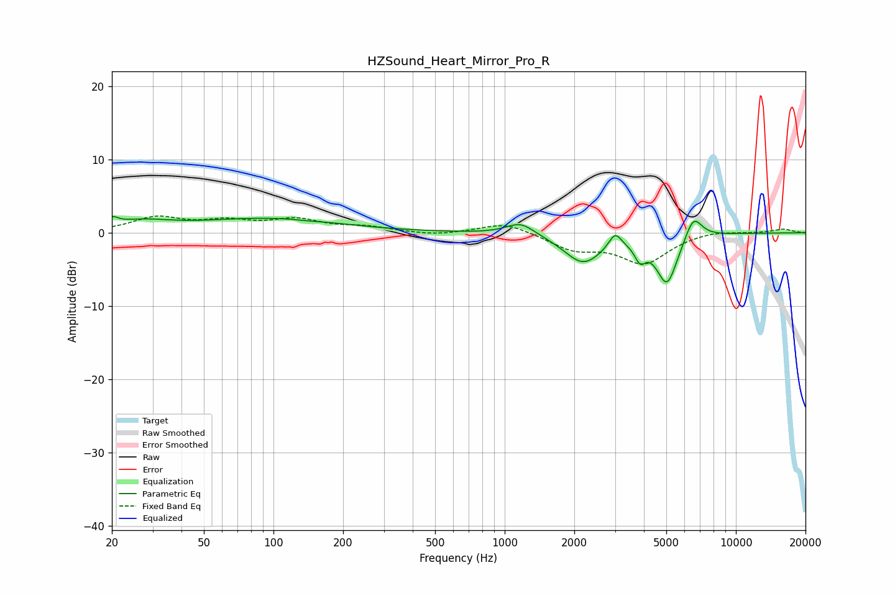

# HZSound_Heart_Mirror_Pro_R
See [usage instructions](https://github.com/jaakkopasanen/AutoEq#usage) for more options and info.

### Parametric EQs
Apply preamp of -2.3 dB when using parametric equalizer.

|   # | Type    |   Fc (Hz) |    Q |   Gain (dB) |
|-----|---------|-----------|------|-------------|
|   1 | Peaking |        20 | 5.96 |         0.9 |
|   2 | Peaking |        26 | 1.06 |         1.3 |
|   3 | Peaking |        96 | 0.47 |         1.9 |
|   4 | Peaking |       141 | 3.65 |        -0.1 |
|   5 | Peaking |      1171 | 2.31 |         1.7 |
|   6 | Peaking |      2186 | 1.7  |        -4.1 |
|   7 | Peaking |      3003 | 5.31 |         2   |
|   8 | Peaking |      3852 | 6    |        -2.2 |
|   9 | Peaking |      5035 | 3.03 |        -6.8 |
|  10 | Peaking |      6553 | 3.7  |         3.3 |

### Fixed Band EQs
When using fixed band (also called graphic) equalizer, apply preamp of **-2.4 dB** (if available) and set gains manually with these parameters.

|   # | Type    |   Fc (Hz) |    Q |   Gain (dB) |
|-----|---------|-----------|------|-------------|
|   1 | Peaking |        31 | 1.41 |         2   |
|   2 | Peaking |        62 | 1.41 |         1.3 |
|   3 | Peaking |       125 | 1.41 |         1.6 |
|   4 | Peaking |       250 | 1.41 |         0.7 |
|   5 | Peaking |       500 | 1.41 |        -0.4 |
|   6 | Peaking |      1000 | 1.41 |         1.5 |
|   7 | Peaking |      2000 | 1.41 |        -2.1 |
|   8 | Peaking |      4000 | 1.41 |        -4   |
|   9 | Peaking |      8000 | 1.41 |         0.4 |
|  10 | Peaking |     16000 | 1.41 |         0.5 |

### Graphs

